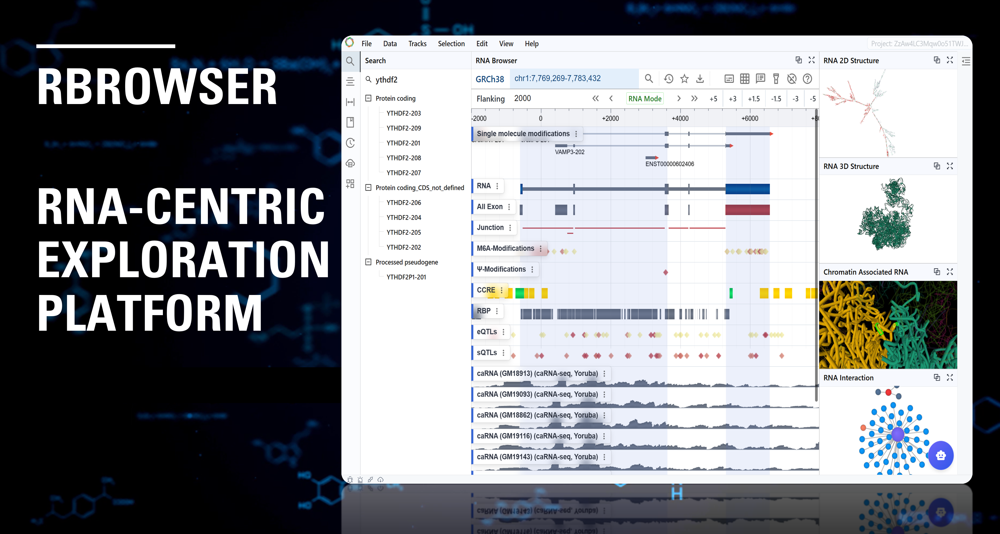

# About RBrowser

{ class="cover-image" }

## Introduction

RBrowser is a novel RNA-centric data exploration platform that uncovers genome–transcriptome crosstalk and integrates multimodal regulatory landscapes by transforming discrete DNA-coordinate data into continuous, focused RNA signal displays to enhance interpretation of RNA-binding proteins, RNA structure, RNA modifications, isoform diversity, and RNA–DNA crosstalk.

## Why use RBrowser

Rapidly evolving RNA research has identified a myriad of intricate regulatory networks and cellular processes impacted by RNA modifications, RNA–protein interactions, and RNA structural dynamicss. However, despite the growing appreciation for the complexity of RNA’s features and functions, there is a paucity of RNA-centric bioinformatic tools requiring researchers to repurpose DNA-centric genome browsers (e.g., IGV4, UCSC Genome Browser5, and WashU Epigenome Browser6) to analyze RNA data. Unfortunately, these tools lack support for RNA-specific features and struggle to render RNA multimodal datasets efficiently, potentially obscuring essential information embedded in RNA datasets. 

- High-performance 2D and 3D renderers have been developed for transcriptome visualization.
- A microkernel-based plugin framework enables seamless integration between RNA and multimodal data.
- An RNA-focused DataHub has been established to store transcriptome, RNA modification, and RNA structure datasets.
- RBrowser GPT provides a natural language interface for querying and exploring the RNA landscape.

## RBrowser Website
[https://www.rbrowser.org](https://www.rbrowser.org)

## [Quick Start](2_quick_start/)
