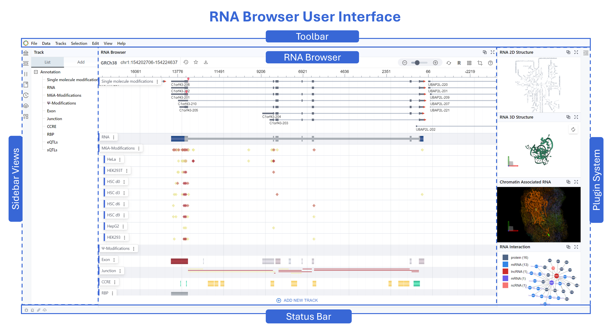

# RBrowser User Interface

## 1. Overview  
The RNA Browser UI is divided into five key regions:  

1. **Toolbar** (top) – Global menus and controls  
2. **Sidebar Views** (left) – Track management and annotations  
3. **Main Browser View** (center) – Continuous, RNA-centric signal display  
4. **Plugin System** (right) – Extensible panels for structures and interactions  
5. **Status Bar** (bottom) – Coordinates, load status, and notifications  

---

## 2. Toolbar  
- **Menus**: File, Data, Tracks, Selection, Edit, View, Help  

---

## 3. Sidebar Views  
- **Search**: Provides a global search box to locate genes, transcripts, coordinates, or keywords across loaded datasets.
- **Track**: Manages all data tracks that render within the main browser.
- **Region**: Enables precise control over the genomic range displayed.
- **Bookmark**: Save and organize regions of interest for later review.  
- **History**: Keeps a chronological log of your actions within the session.
- **DataHub**: Interface to external data sources and repositories.
- **Plugin**: List and configure optional extensions that enhance the core browser.  

---

## 4. Main Browser View  
- **Annotation Channel**  
  RNA annotations channel: single-molecule mods, m6A, Ψ, exon, junction, CCRE, RBP, eQTL, sQTL
  and Other singals
- **Expand Channel**  
  Expand each channel to view per-sample datasets (e.g. HeLa, HEK293T, HSC d0/d3/d6/d9)  
- **Controls**  
  Collapse/expand, remove, adjust opacity or color mapping  
- **RNA-Centric Signals**  
  Converts discrete DNA-coordinate features into smooth, continuous tracks focused on transcript coordinates  
- **Isoform Visualization**  
  Exons and junctions rendered as arrowed segments indicating structure & direction  
- **Multi-track Overlay**  
  Vertically stacked tracks for side-by-side comparison of binding, structure, modifications, splicing  
- **Interactive Navigation**  
  Click-and-drag panning, scroll-wheel zooming, real-time redraws  

---

## 5. Plugin System  
- **RNA 2D Structure**  
  - Secondary-structure diagram; zoom, pan & export  
- **RNA 3D Structure**  
  - Interactive 3D folding model with rotation controls  
- **Chromatin-Associated RNA**  
  - 3D view of RNA–chromatin contacts  
- **RNA Interaction Network**  
  - Graph of RNA–RNA and RNA–protein interactions; nodes color-coded by molecule type (protein, miRNA, lncRNA, mRNA, ncRNA)  

---

## 6. Status Bar  
- **Coordinates & Scale**  
  - Displays chromosome, start–end positions, and zoom scale (bp/pixel)  
- **Load & Cache Status**  
  - Icons/text for data-loading progress, cache hits, thread utilization  

---

RNA Browser transforms discrete genomic coordinates into a unified, RNA-focused visualization framework. By integrating multi-modal annotations and extensible plugins—spanning secondary and tertiary RNA structures through interaction networks—it provides researchers with an intuitive, high-resolution platform for exploring RNA–DNA crosstalk and transcriptome regulation.