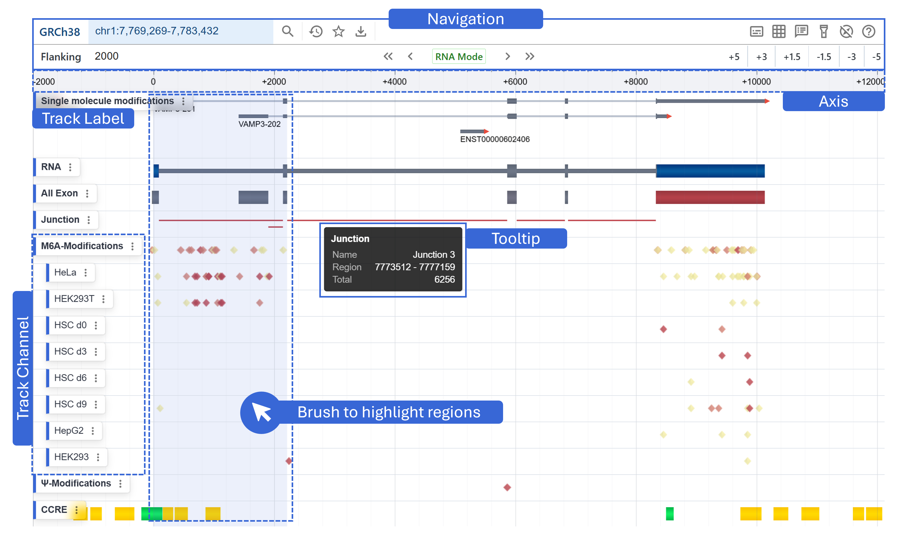
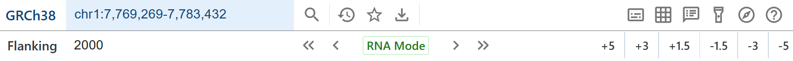
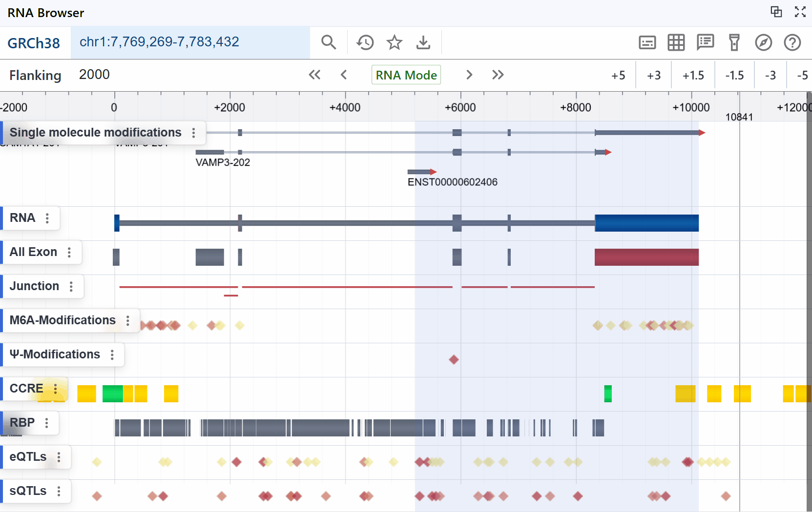
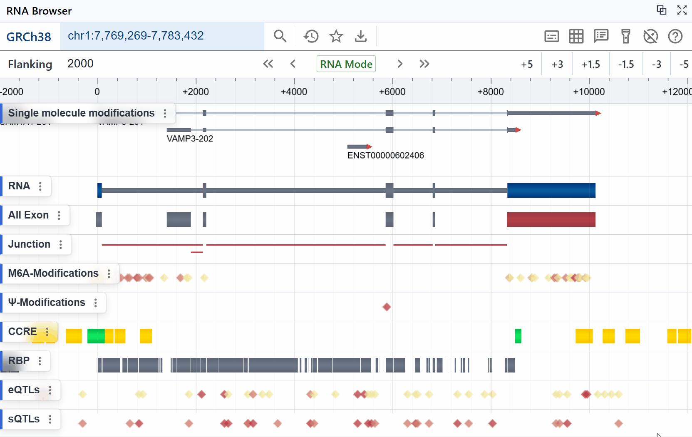
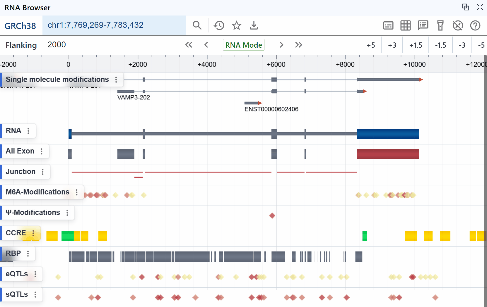
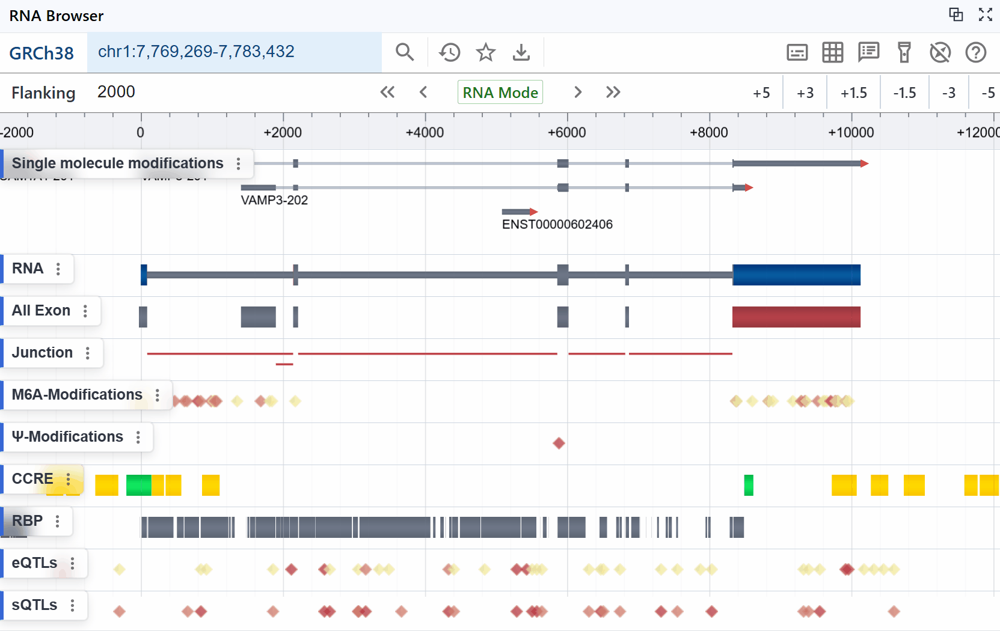
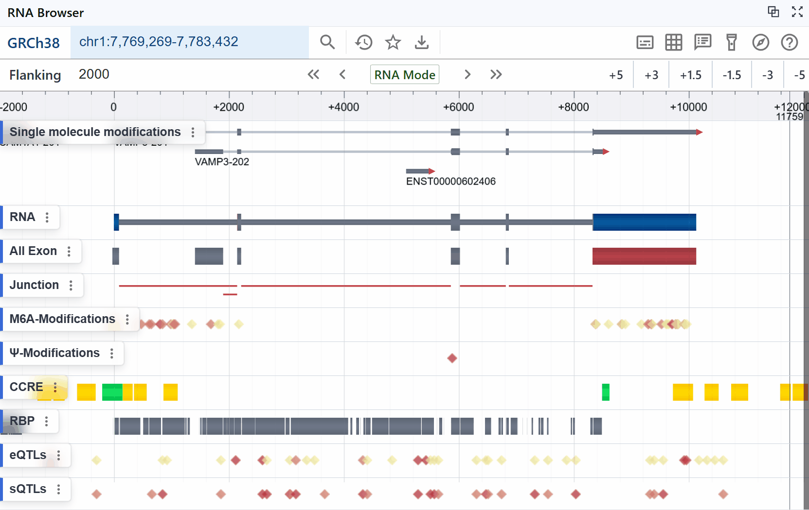
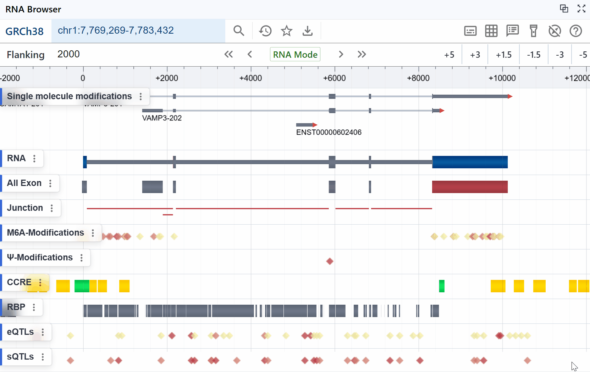
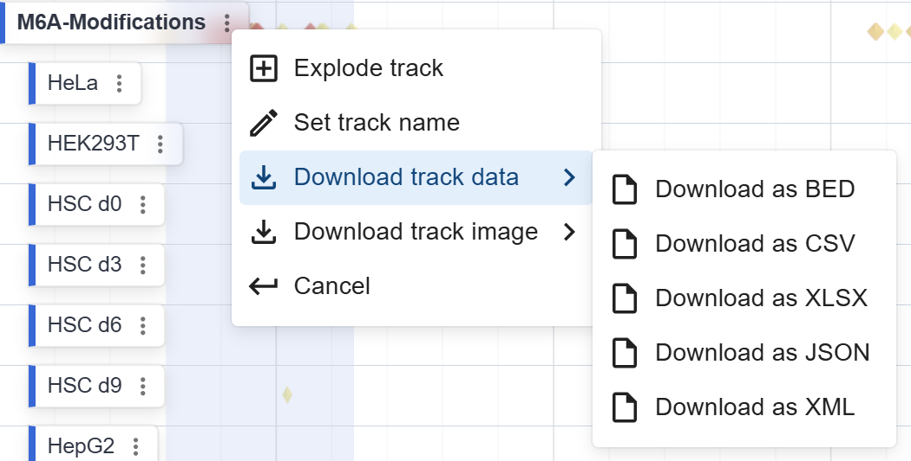

# RBrowser Main Viewer

## Navigation  
The Navigation panel is organized into two horizontal tiers for efficient, contextual control:

{ class="cover-image" }

### Primary Controls (Top Row)  

1. **Reference Version**  
   Displays the current reference assembly (e.g. GRCh38).  
2. **Search Box**  
   Enter gene names, transcript IDs, or coordinate ranges for instant lookup.  
   { class="cover-image" }
3. **History**  
   Access a drop-down of recently navigated regions.  
4. **Bookmark**  
   Save or recall custom “favorite” views (region + active tracks).  
5. **Download**  
   Export the visible tracks or sequence data.  
6. **Track Label Toggle**  
   Show or hide the left-hand track names panel.  
      { class="cover-image" }

7. **Grid Toggle**  
   Enable or disable the background grid lines. 
   { class="cover-image" }

8. **Tooltip Settings**  
   Configure what information appears on hover. 
   { class="cover-image" }

9. **Highlight Region Toggle**  
   Show or hide the brushed selection overlay.  
   { class="cover-image" }

10. **Cursor Settings**  
   Switch pointer modes (pan, select, measure).  
   { class="cover-image" }

11. **Help**  
   Open contextual help and documentation.

### Coordinate Adjustment Controls (Second Row)  

1. **Flanking Width**  
   Specify upstream/downstream padding around the region (e.g. ±2000 bp).  
2. **Coordinate System Switch**  
   Toggle between **DNA**, **RNA**, or **CDS** coordinate modes.  

   { class="cover-image" }

3. **Zoom Presets**  
   Quick scale buttons (e.g. +5×, +3×, +1.5×, –1.5×, –3×, –5×).

---

## Track Label  
- Displays the name of each track (e.g. “M6A-Modifications”, “Junction”, “RNA”).  
- Provides per-track settings: Explode, Name, Download.  

  { class="cover-image" }

!!! tips
    This download provides only the data or image for this specific track in the current region, and you can choose different file formats to download based on your needs.

- Can be toggled on/off via the **Track Label Toggle** button in Primary Controls.

---

## Additional Elements  
- **Axis**  
  Shows the continuous coordinate scale (in bases or residues) along the top.  
  Adjusts dynamically to the selected DNA/RNA/CDS mode.  
- **Tooltip**  
  Hover over any feature to reveal a floating info box (e.g. feature name, coordinates, counts).  
  Configurable under **Tooltip Settings**.  
- **Highlight Region**  
  Click-and-drag to brush a selection; the shaded overlay indicates the active region for zooming or filtering.  
  Toggle visibility with the **Highlight Region Toggle** button.  
