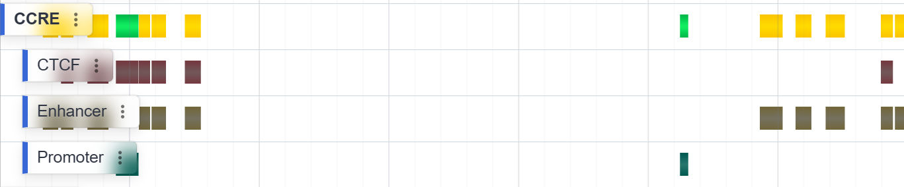
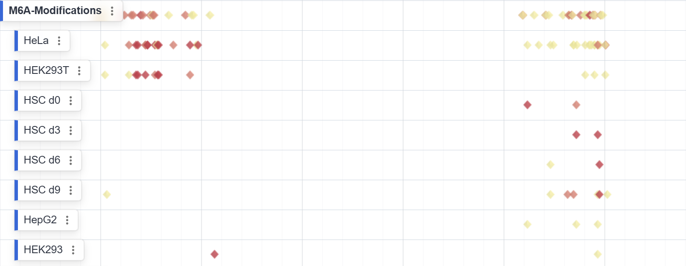
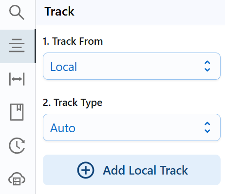
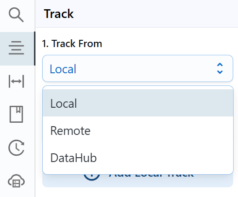

# Channel and Track

## Channel      
- A **Channel** contains a predefined set of tracks grouped by data type.  

    { class="cover-image" }

- Typically represents one assay or annotation across multiple tissues or methods (e.g. M6A sites in HeLa, HEK293T, HSC d0–d9).  

    { class="cover-image" }


### Expanding Channels  
A channel may contain multiple individual tracks. To expand a channel and view all its sub-tracks:  
1. Hover over or click the channel’s **Track Label** in the sidebar.  
2. Open the context menu and select **Explode**.  

---

### Searching Tracks *(TODO)*  
You can search for specific tracks within a channel by keyword. This feature will allow you to quickly locate tracks of interest.

---


## Loading Tracks

1. **Open the Track Panel**  
   Click the **Track** button in the left sidebar to open the track operations panel.

   { class="cover-image-sm" }

2. **Choose Data Source**  
    { class="cover-image-sm" }
   RBrowser can load tracks from three sources:  
        **Remote** (HTTP/S URLs)  
        **Local** (files on your computer)  
        **DataHub** (configured public or private hubs)

    !!!Warning
        Modern browsers (e.g. Chrome) do not allow saving session state for locally-loaded files.  We recommend loading from **Remote** or **DataHub** when you need to preserve your session.

3. **Select File Type**  
   A variety of bioinformatics file formats are supported (e.g. FASTA, GFF, BigWig, BAM, BED, BigBed).  
   **Auto**: RBrowser will auto-detect the format based on the file extension, or you can select it manually.

   { class="cover-image-sm" }

4. **Add Track**  
   Once your source and format are configured, click **Add Track** to import and render the data.

!!!tips
    The quickest way to load local files is to drag and drop them directly onto the RBrowser window.  

---

## Removing Tracks

1. **Open the Track Menu**  
   Hover over or click the track’s label in the sidebar to reveal its context menu.

2. **Remove the Track**  
   Click **Remove Track** in the menu. The selected track will be immediately removed from the main browser view.


## Ordering Tracks *(TODO)*  
To sort the tracks within a channel:  
Open the **Track Label** context menu. Click **Order Tracks** and choose your preferred sort criteria.  

---

## Filtering Tracks *(TODO)*  
Use the **Filter** command in the **Track Label** context menu to restrict which tracks are displayed:

- **Annotation-based (string) filters**  
  ```js
  rbrowser:get('name') == 'YTHDF2'  // Show only tracks with gene name “YTHDF2”
  rbrowser:get('type') == 'CDS'     // Show only CDS-region tracks
  ```

- **Value-based (numeric) filters**
```js
  rbrowser:get('score') > 10        // Show only signals with score > 10
```