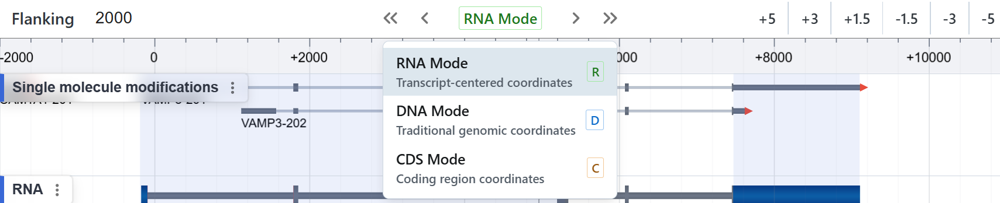
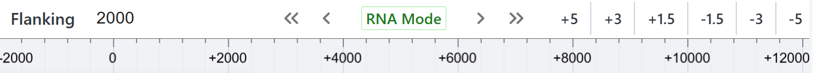
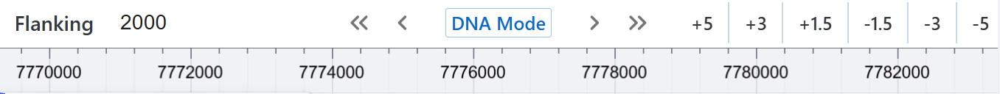
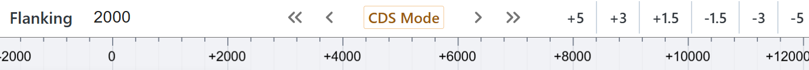

# Coordinate System

When studying mature (spliced) RNA or protein-coding regions—for example, mapping RNA-binding proteins, RNA secondary‐structure features, or single-molecule modification sites—we often need to focus on the spliced transcript itself or just the coding sequence (CDS). Traditional chromosome‐based genomic coordinates span introns and untranslated regions, making it hard to zoom in on exactly what matters.

Similarly, when examining regulatory elements around a specific transcript or gene—such as promoters or CTCF binding sites—you rarely need to view multi-megabase genomic spans. Instead, you care about the relative distance to the target transcript, whether you’re analyzing binding regions, splice junctions, or modification sites.

To address these distinct needs, our browser provides three coordinate modes:

## 1. RNA Mode  

{ class="cover-image" }

**Transcript-centered coordinates**  

- **Use case:** Inspect features *within* a fully spliced transcript—exons stitched together in their mature order. 

- **Ideal for:**  
  - RNA-binding protein footprints  
  - RNA secondary-structure annotations  
  - Single-molecule RNA modification calls (e.g. m⁶A, m⁵C)  

- **Behavior:**  
  - The “zero” origin is the *5′ end of the first exon*.  
  - Exon boundaries are laid out sequentially with intron.  
  - Distance units reflect transcript length (in nucleotides).

## 2. DNA Mode  

{ class="cover-image" }

**Traditional genomic coordinates**  

- **Use case:** Explore raw genomic context—chromosome, reference position, and unaltered intergenic regions.  

- **Ideal for:**  

  - Viewing unprocessed tracks such as raw coverage or ChIP-seq peaks  
  - Comparing with any genome-wide annotation or epigenomic track  
  - More

- **Behavior:**  

  - Standard chromosome coordinates are displayed along the axis.  
  - Introns, intergenic regions, and all native spacing are preserved.

## 3. CDS Mode  

{ class="cover-image" }

**Coding-sequence coordinates**  

- **Use case:** Focus tightly on the protein-coding portion of the transcript only.  
- **Ideal for:**  

  - Variant interpretation within coding sequence  
  - CDS-specific modification or binding analyses  
  - Cross-transcript comparisons of coding region features  

- **Behavior:**  

  - The axis spans from the annotated start codon (ATG) to the stop codon.  
  - 5′ and 3′ untranslated regions (UTRs) and introns are omitted.  
  - Distance is measured in codons or nucleotides of CDS.

---

## Switching Modes

- **Click** the green **“RNA Mode”** button in the toolbar to reveal the dropdown.  
- **Keyboard shortcuts:**  
  - Press <kbd>Shift</kbd> + <kbd>R</kbd> to activate **RNA Mode**  
  - Press <kbd>Shift</kbd> + <kbd>D</kbd> to switch to **DNA Mode**  
  - Press <kbd>Shift</kbd> + <kbd>C</kbd> to jump to **CDS Mode**  

Use the coordinate system that best matches your analysis goals—whether you need a transcript-centric view, the full genomic context, or a focused look at coding sequence.  
