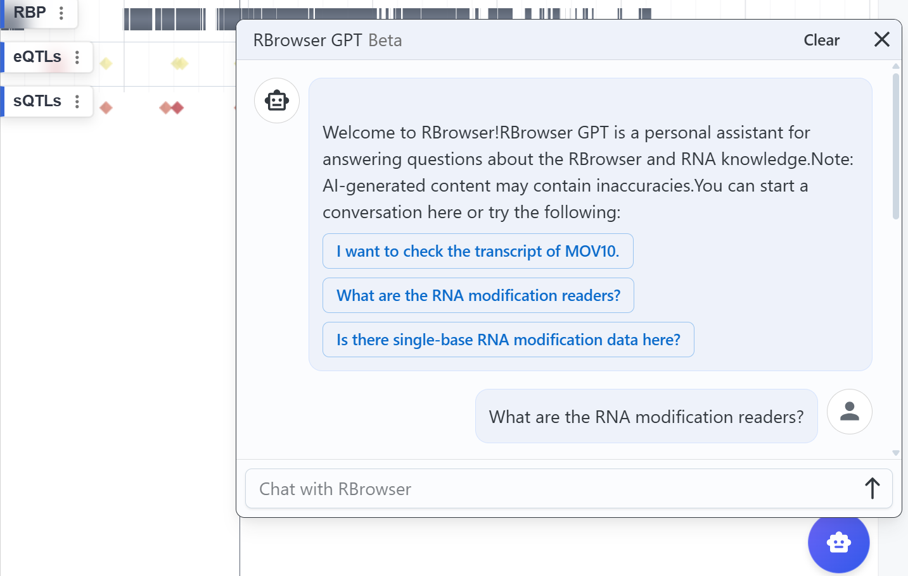
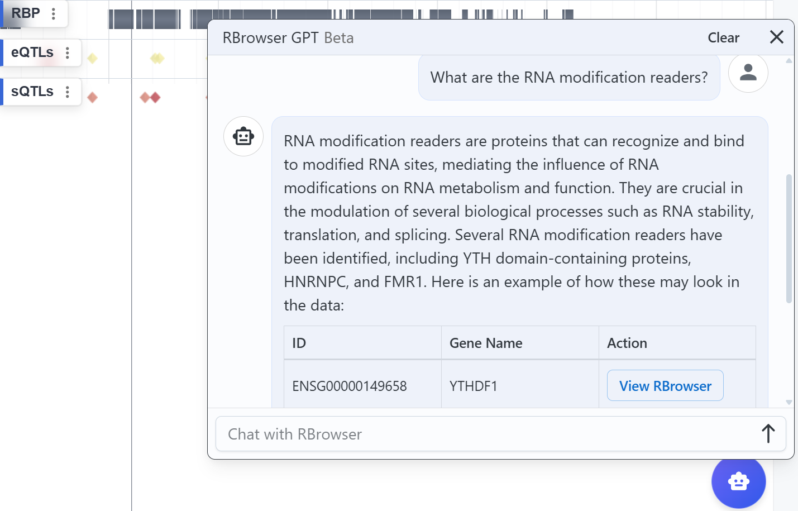
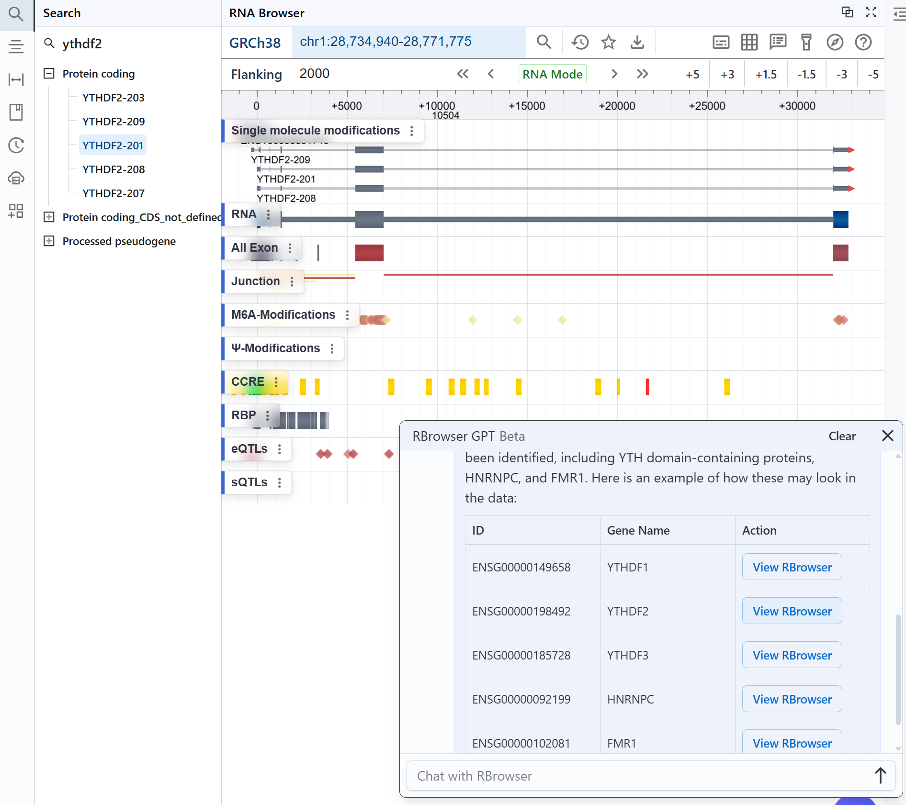

# RBrowser GPT

To further enhance usability and efficiency, RBrowser GPT leverages artificial intelligence (AI) to facilitate interactive RNA data exploration. This AI-powered assistant provides:
Automated Query Assistance – Users can input natural language queries, and RBrowser GPT retrieves relevant RNA datasets and annotations.

Context-Aware Data Interpretation – The AI model analyzes user-selected transcript regions and suggests potential RNA modifications, interactions, and functional annotations.
Streamlined Data Navigation – Guides users through multi-layered transcriptome data, improving workflow efficiency and interpretation.

Users can open the **RBrowser GPT** chat window by clicking the robot icon in the bottom-right corner.  
We provide several simple prompt examples for you to choose from.  
You can also ask **any RNA-related question** based on your own research needs.

{class="cover-image" }

!!! Warning
    AI-generated content may contain inaccuracies.  
    Due to the current state of technology, all generative AI systems cannot guarantee the absolute accuracy of information.

### Example:

When you type a question like `What are the RNA modification readers?` into the chat box and click the `↑` button to send it to RBrowser GPT, you will receive a brief overview along with a table listing RNA modification readers.

{class="cover-image" }

Next, You can click `View RBrowser` in the **Action** column, and the current rendering window will jump to the corresponding transcript or gene.

{class="cover-image" }
