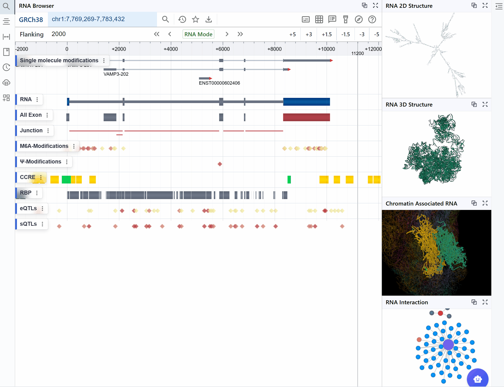
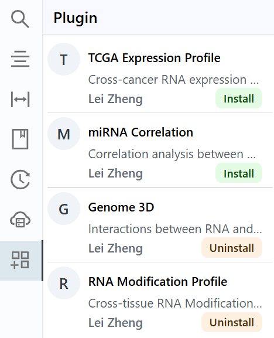

# Plugin System Overview

{ class="cover-image-lg" }

## Introduction
RBrowser is designed with a modular and extensible architecture, allowing researchers and developer to customize their analysis pipelines and integrate third-party tools. One of the key advantages of this design is the ability for different modules to communicate asynchronously, ensuring a seamless and integrated analysis experience. For example, selected linear track signals from transcriptome views can be dynamically displayed in RNA Structure or 3D Genome modules, enabling real-time visualization of transcriptomic features across multiple structural contexts. Key advantages include:
Microkernel-Based Plugin System – Enables seamless addition of new functionalities without affecting core browser viewer performance.
- Independent Module Loading – Users can selectively load specific analysis tools for RNA structure, RNA modification analysis, or transcript quantification.
Asynchronous Data Transmission Between Modules – Allows seamless interaction between different visualization layers, ensuring that selected transcript regions can be mapped across linear, secondary, and 3D genome contexts.

## Dynamic Synchronization Across Plugins

You can select a region of interest, and the plugins will automatically synchronize data dynamically.  
RBrowser also supports mapping signal values (m⁶A, m⁵C, RNA structure probing, etc.) from tracks to plugin renderers.  
It enables synchronization of transcript, gene, and other related data across all plugins without affecting the main application's performance.

{ class="cover-image" }

## Plugin Management

### Plugin Install  
Open the plugin panel from the left sidebar, where you can view plugin names, brief descriptions, authors, and more.  
Click the `Install` button in the bottom right to load the corresponding module into the rendering queue.

{class="cover-image-sm" }

### Plugin Uninstall  
To remove a plugin, simply click the `Uninstall` button.
