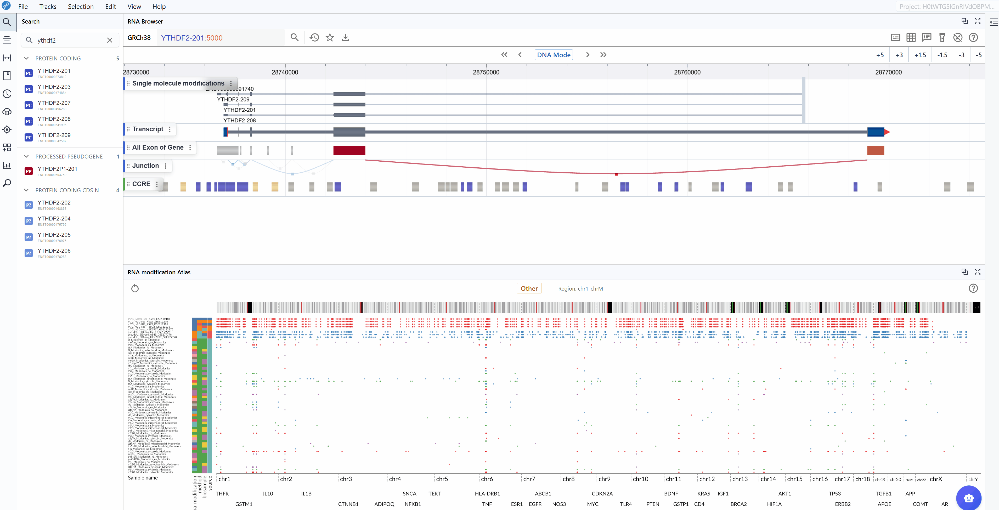

# RNA Modification Atlas
{ class="cover-image-lg" }

## Overview
The RNA Modification Atlas plugin provides a comprehensive visualization platform for exploring epitranscriptomic modifications across the genome. This powerful tool integrates multiple RNA modification datasets, allowing researchers to investigate modification patterns, compare different modification types, and explore their distribution across transcripts and genomic regions. The plugin supports real-time interactive visualization with multi-window comparison capabilities, making it an essential tool for epitranscriptomics research.

## Cross-window Real-time Rendering
The multi-window feature enables simultaneous visualization and comparison of RNA modifications across different genomic regions or modification types. This functionality is particularly useful for comparative analysis and exploring modification patterns in parallel.

{ class="cover-image-lg" }

**How to use:**

1. **Create a new window**: Click the  :material-content-copy:  button to open an additional RNA Modification Atlas viewer. Each new window operates independently, allowing you to explore different regions or modification types simultaneously.

2. **Synchronized navigation**: When you search for and navigate to a specific transcript in one window, all open windows will automatically synchronize to the same genomic interval and zoom level. This synchronized behavior facilitates direct comparison of modification patterns across different datasets or conditions.

3. **Multi-region comparison**: Open multiple windows to compare RNA modifications in different genomic regions side-by-side, enabling you to identify regional differences or similarities in modification patterns.

## Key Features and Usage

### Viewing and Switching RNA Modification Types

{ class="cover-image-lg" }

The RNA Modification Atlas currently supports three major categories of RNA modifications, each representing a distinct class of epitranscriptomic marks:

- **m6A (N6-methyladenosine)**: The most prevalent internal modification in eukaryotic mRNA, playing crucial roles in RNA metabolism, translation, and stability.
- **m5C (5-methylcytosine)**: An important RNA modification involved in RNA export, translation, and stability regulation.
- **Other RNA Modifications**: A comprehensive collection of additional modification types including pseudouridine (Ψ), m7G, and various other chemical modifications.

**Dataset Information:**

Each RNA modification dataset in the atlas includes comprehensive metadata to help you understand the data source and experimental context:

- **Sequencing Method**: The detection technology used (e.g., MeRIP-seq, miCLIP, m6A-seq, DART-seq, etc.)
- **Biological Sample**: The tissue type, cell line, or organism from which the data was generated
- **Dataset ID**: The unique identifier linking to the original data source (e.g., GEO accession, SRA number)
- **RNA Modification Type**: The specific chemical modification detected in the dataset

**How to explore modification types:**

1. **View dataset details**: Hover your mouse over the colored rectangular boxes on the left side of the interface. A tooltip will display detailed information about each dataset, including sequencing method, sample origin, data source ID, and modification type.

2. **Switch modification types**: Click the central toggle button to switch between different RNA modification types at the genome-wide scale. The visualization will update in real-time to display the selected modification type across all loaded datasets.

3. **Monitor genomic coordinates**: The right side of the toggle button displays the current genomic coordinates of the visible region, updating dynamically as you navigate through the genome. This helps you keep track of your current position at all times.

### Searching for Transcripts

The transcript search functionality allows you to quickly navigate to specific genes or transcripts of interest and examine their modification landscape in detail.

{ class="cover-image-lg" }

**How to search for transcripts:**

1. **Access the search box**: Locate the search box in the left panel of the RNA Modification Atlas interface.

2. **Enter transcript identifier**: Type the transcript ID, gene symbol, or gene name you wish to explore. The search supports various identifier formats including:

   <ul>
     <li>Ensembl transcript IDs (e.g., <code>ENST00000000233</code>)</li>
     <li>Ensembl transcript names (e.g., <code>VAMP3-201</code>)</li>
     <li>Gene symbols (e.g., <code>GAPDH</code>, <code>ACTB</code>)</li>
   </ul>

3. **Select your target**: As you type, a list of matching transcripts will appear. Click on your transcript of interest from the list.

4. **Automatic focusing**: Once selected, the viewer will automatically zoom to and center on the chosen transcript, displaying all available modification data within and around the transcript region. This allows you to immediately assess the modification profile of your gene of interest.

5. **Examine modification patterns**: After focusing on a transcript, you can observe:

   <ul>
     <li>Distribution of modifications along the transcript</li>
     <li>Modification density in different transcript regions (5'UTR, CDS, 3'UTR)</li>
     <li>Comparative modification patterns across different datasets</li>
     <li>Neighboring genes and their modification profiles</li>
   </ul>

!!! tip
    When using the multi-window feature, searching for a transcript in one window will synchronize all open windows to the same transcript location, enabling simultaneous comparison across different modification types or datasets.

### Navigation: Zoom In/Out and Reset

Efficient navigation is crucial for exploring RNA modifications at different genomic scales, from single-nucleotide resolution to chromosome-wide views.

**Zooming operations:**

1. **Mouse wheel zoom**: 
   - Position your mouse cursor over the region you want to examine more closely
   - Scroll up with your mouse wheel to zoom in and increase resolution
   - Scroll down to zoom out and view a broader genomic context
   - The zoom operation centers around your cursor position, allowing precise control over the region of interest

2. **Zoom levels**: The plugin supports seamless zooming across multiple scales:
   - **Nucleotide level**: Examine individual modification sites and their precise genomic positions
   - **Transcript level**: View entire transcripts with their modification patterns
   - **Gene level**: Compare modifications across multiple isoforms
   - **Chromosomal level**: Survey modification distribution across large genomic regions

**Reset function:**

When exploring large genomic regions, it's easy to lose track of your original focus area. The Reset feature provides a quick way to return to your starting point:

Simply click the  :material-refresh:  button in the interface. The view will immediately return to the originally selected transcript, restoring the default zoom level centered on that transcript.

**Navigation tips:**

- Combine zooming with the multi-window feature to simultaneously view a transcript at different resolutions
- Use the coordinate display (right side of the modification type button) to track your current genomic position
- After resetting, you can zoom to a different level while maintaining focus on the transcript

{ class="cover-image-lg" }

## Best Practices for RNA Modification Analysis

To maximize your productivity with the RNA Modification Atlas plugin, consider these workflow recommendations:

1. **Start with transcript search**: Begin your analysis by searching for your gene or transcript of interest rather than manually navigating the genome.

2. **Compare modification types**: Use the multi-window feature to open multiple instances and compare m6A, m5C, and other modifications on the same transcript simultaneously.

3. **Examine dataset metadata**: Always check the dataset information (sequencing method, sample type) before drawing conclusions, as different detection methods may have varying sensitivities and biases.

4. **Use multiple zoom levels**: Start with a broad view to understand the overall modification landscape, then zoom in to examine specific sites in detail.

5. **Leverage synchronized navigation**: When comparing datasets, use the transcript search synchronization feature to ensure all windows show the same region.

6. **Reset when needed**: Don't hesitate to use the Reset button to quickly reorient yourself if you get lost during navigation.

## Troubleshooting

**Issue**: The plugin doesn't display any modifications after switching types.
**Solution**: Ensure that datasets for the selected modification type are loaded. Check your data source configuration.

**Issue**: Windows don't synchronize when searching for transcripts.
**Solution**: Make sure all windows are fully loaded before performing a search. Refresh if necessary.

**Issue**: Zooming is too sensitive or not responsive.
**Solution**: Adjust your mouse wheel settings in your system preferences, or try using smaller scroll increments.

For additional support or to report issues, please visit the [Contact](../5_contact/index.md) page.