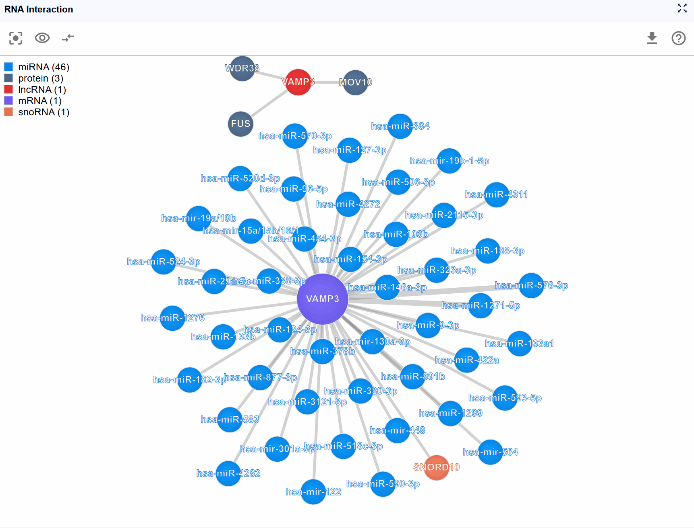

# RNA Interaction Viewer

{ class="cover-image-lg" }

## Overview

The RNA Interaction Viewer provides an interactive network visualization platform for exploring complex biomolecular interactions across three major categories: RNA-protein, RNA-RNA, and RNA-DNA interactions. This powerful plugin integrates diverse experimental datasets including CLIP-seq, eCLIP, CLASH, PARIS, ChIRP-seq, and other high-throughput sequencing technologies, enabling researchers to discover and analyze regulatory networks in an intuitive force-directed graph interface. The plugin supports flexible filtering, metadata exploration, and multi-window comparison capabilities, making it an essential tool for understanding gene regulation and cellular function.

## Cross-window Real-time Rendering

The RNA Interaction Viewer supports multi-level visualization through dual window modes, enabling you to examine interaction networks from both global and detailed perspectives simultaneously.

**How to use multi-window mode:**

1. **Create a new window**: Click the :material-content-copy: button to open a dedicated interaction viewer window. This provides a more detailed and expanded view of the interaction network.

2. **Two-level visualization system**:
   - **Global Level (Embedded Plugin)**: The embedded view within the main RBrowser interface provides a high-level overview showing:
     - Total number of interactions
     - Types of biomolecules involved in interactions
     - Overall network topology
     - Quick summary statistics
   
   - **Detailed Level (New Window)**: The dedicated window displays comprehensive information including:
     - Full molecular names and identifiers
     - Specific interaction type labels
     - Detailed metadata for each node and edge
     - Enhanced visualization controls

3. **Synchronized navigation**: When you search for a transcript ID in either window, all open RNA Interaction windows will automatically synchronize to display the same transcript and its interaction network. This ensures consistent views across multiple windows and facilitates comparative analysis.

**Use cases:**

- Compare global network topology with detailed molecular information
- Keep the overview visible while exploring specific interactions in detail
- Monitor multiple transcripts' interaction networks simultaneously
- Present data at different levels of detail for different audiences

{ class="cover-image-lg" }

---

## Interactive Features and Usage

The RNA Interaction Viewer provides a highly flexible and intuitive interface for exploring complex biomolecular interaction networks. The interactive visualization allows you to manipulate the network layout and access detailed metadata for comprehensive analysis.

### Navigation and Layout Manipulation

**Pan and zoom the entire view:**

- **Panning**: :material-mouse-left-click-outline: Click and drag anywhere on the background to move the entire network view
- **Zooming**: :material-mouse-move-vertical:  Mouse wheel to zoom in and out, allowing you to examine the network at different scales
- **Free exploration**: Navigate freely through the interaction space to find the most informative perspective

**Rearrange individual nodes:**
- **Drag molecular nodes**: Click and hold any biomolecule node (circle) to drag it to a new position
- **Optimize layout**: Manually arrange nodes to reduce edge crossings and improve visual clarity
- **Persistent positioning**: Node positions are maintained during your session, allowing you to create custom layouts that best represent the biological relationships

### Accessing Detailed Metadata

The plugin provides comprehensive metadata for each element in the interaction network, facilitating data traceability and reproducibility.

**Biomolecule node information:**

Hover over or click on any molecular node to view detailed annotations including:

- **Molecule Type**: Classification of the biomolecule (e.g., mRNA, lncRNA, miRNA, protein)
- **Molecule ID**: Database identifiers such as Ensembl IDs, RefSeq IDs, UniProt IDs, or miRBase IDs
- **Molecule Name**: Standard gene symbol or common name
- **Molecule Category**: Functional classification (e.g., RNA-RNA,RNA-protein)

**Interaction edge information:**

Hover over or click on interaction edges (connecting lines) to access experimental details:

- **Detection Method**: The experimental technique used to identify the interaction (e.g., CLIP-seq, eCLIP-seq, CLASH, PARIS, ChIRP-seq, CHART-seq)
- **Biological Sample**: The cell type, tissue, or organism from which the interaction was detected
- **Data Source**: Original publication, database accession number (GEO, SRA, ArrayExpress), or resource name

**Best practices for metadata exploration:**

1. Always check the detection method to understand the experimental evidence supporting an interaction
2. Consider the biological sample context when interpreting the relevance of interactions
3. Use molecule IDs to cross-reference with external databases for additional information
4. Compare interactions detected by different methods to assess consistency

{ class="cover-image" }

The header button group provides multiple powerful functions to customize your interaction network view:

## Molecule Type Filtering

Complex interaction networks often involve numerous molecular types, which can make the visualization crowded and difficult to interpret. The legend control allows you to selectively display molecule types of interest, helping you focus on specific biological questions.

{ class="cover-image" }

**How to use the legend controls:**

1. **View the legend**: The legend is displayed in the upper-left corner of the viewer, showing all molecule types present in the current interaction network with their corresponding colors.

2. **Filter molecule types**: Click on any molecule type name in the legend to toggle its visibility:
**Hide a type**: Click once to hide all nodes of that molecular type and their associated interactions
 **Show a type**: Click again to restore visibility
**Multiple selections**: You can hide/show multiple molecule types simultaneously to create custom filtered views

3. **Toggle legend visibility**: When the legend overlaps with important network content, click the :octicons-eye-24: button to hide the entire legend panel. Click again to restore it.

!!! tip
    **Focus on RNA-protein interactions**: Hide all RNA molecule types except your transcript of interest, and keep only protein nodes visible 
    **Examine regulatory RNAs**: Display only miRNAs and lncRNAs to study non-coding RNA regulation 
    **Reduce complexity**: In highly connected networks, progressively hide less relevant molecule types to reveal core regulatory relationships 
    **Compare molecule classes**: Hide all but two molecule types to examine specific interaction patterns

## Controlling Display Density

For highly connected genes or regulatory hubs, interaction networks can become overwhelming with hundreds of nodes and edges. The Show Number feature allows you to control the display density by limiting the number of rendered molecules, helping you focus on the most important interactions.

{ class="cover-image" }

**How to adjust display limits:**

1. **Access the control**: Click the :octicons-arrow-switch-24: button in the header to cycle through different rendering limits.

2. **Available display levels**: The plugin typically offers several preset limits:
**Top 100**: Show the 100 key interactions
**Top 50**: Display 50 key interactions for a balanced view
**Top 25**: Focus on the most critical interactions for simplified analysis

3. **Prioritization logic**: When interactions are limited, the plugin prioritizes display based on:
   - Strength of experimental evidence
   - Number of supporting experiments

**When to adjust display limits:**

- **Initial exploration**: Start with a lower number (25-50) to get an overview without overwhelming complexity
- **Detailed analysis**: Increase to show more interactions once you've oriented yourself
- **Presentation mode**: Use lower numbers for clearer, more focused visualizations in presentations
- **Hub genes**: For genes with hundreds of interactions (e.g., major transcription factors), limiting display is essential for interpretability

!!! tip
    Combine display limits with molecule type filtering for maximum control.

## Reset View

After extensive exploration through zooming, panning, and node rearrangement, you may lose track of the original network center or optimal viewing angle. The Reset function provides a quick way to restore the default view configuration.

{ class="cover-image" }

**How to reset the view:**

1. **Click the reset button**: Press the :material-image-filter-center-focus-strong: button in the header toolbar.

2. **What gets reset**: 
   **View center**: The network is re-centered on the primary transcript or focal molecule 
   **Zoom level**: Returns to the default zoom that shows the entire network comfortably 
   **Node positions**: manual arrangements are NOT lost

---

## Workflow Recommendations

To maximize your productivity with the RNA Interaction Viewer, consider these analytical workflows:

### For Exploratory Analysis:

1. **Start broad**: Begin with the global level view in the embedded plugin to understand the overall network complexity
2. **Open detailed window**: Create a new window for in-depth exploration
3. **Filter strategically**: Use legend controls to hide less relevant molecule types
4. **Limit initial display**: Start with 25-50 interactions to avoid overwhelming complexity
5. **Examine metadata**: Click on nodes and edges to understand the experimental basis
6. **Adjust as needed**: Gradually increase display limits or show additional molecule types as you narrow your focus

### For Hypothesis-Driven Research:

1. **Search your target**: Use transcript search to navigate directly to your gene of interest
2. **Focus the view**: Filter to show only molecule types relevant to your hypothesis (e.g., only miRNAs if studying transcriptional regulation)
3. **Verify evidence**: Check interaction metadata to assess experimental support
4. **Compare conditions**: Use multi-window mode to compare the same transcript's interactions across different datasets
5. **Manual curation**: Arrange key nodes manually to create a clear representation of your proposed regulatory model

### For Network Topology Analysis:

1. **Display complete network**: Set show number to "All" to see full connectivity
2. **Identify hubs**: Look for highly connected nodes that may represent regulatory hubs
3. **Examine subnetworks**: Use filtering to isolate and study specific regulatory modules
4. **Cross-reference**: Compare network properties with functional annotations and expression data

---

## Understanding Interaction Types

The RNA Interaction Viewer integrates multiple types of molecular interactions:

### RNA-Protein Interactions

- **Source data**: CLIP-seq, eCLIP-seq, PAR-CLIP, iCLIP
- **Biological significance**: RNA-binding proteins (RBPs) that regulate RNA splicing, stability, translation, and localization
- **Interpretation tips**: Consider RBP binding in the context of RNA structure and sequence motifs

### RNA-RNA Interactions

- **Source data**: CLASH, PARIS, LIGR-seq, miRNA target predictions
- **Biological significance**: 
  - miRNA-mRNA targeting for post-transcriptional silencing
  - lncRNA-mRNA interactions for regulatory control
  - RNA duplex formation in trans
- **Interpretation tips**: Validate computational predictions with experimental evidence; consider tissue-specific expression

### RNA-DNA Interactions

- **Source data**: ChIRP-seq
- **Biological significance**: Chromatin-associated RNAs (caRNAs) involved in transcriptional regulation, chromatin remodeling, and epigenetic modifications
- **Interpretation tips**: Consider genomic context and chromatin state; examine co-localization with transcription factors

---

## Troubleshooting

**Issue**: The network appears too crowded and difficult to interpret.
**Solution**: 
1. Reduce the display number using the :octicons-arrow-switch-24: button
2. Hide less relevant molecule types using the legend controls
3. Focus on a specific transcript using the search function

**Issue**: Important interactions seem to be missing.
**Solution**: 
1. Check if the display number limit is too restrictive—increase it
2. Verify that the relevant molecule types are not hidden in the legend
3. Confirm that the appropriate datasets are loaded in your configuration

**Issue**: The view becomes sluggish when displaying large networks.
**Solution**: 
1. Reduce the display number to improve performance
2. Close unnecessary windows
3. Filter molecule types to reduce the number of rendered elements

**Issue**: Manual node arrangements are lost after certain operations.
**Solution**: The reset button and some filtering operations will restore automatic layouts. Save screenshots of important manual layouts before these operations.

**Issue**: Tooltips or metadata don't appear when hovering over nodes.
**Solution**: 
1. Ensure you're hovering directly over the node or edge
2. Check that your browser allows tooltips (some browser extensions may block them)

For additional support, please visit the [Contact](../5_contact/index.md) page.

