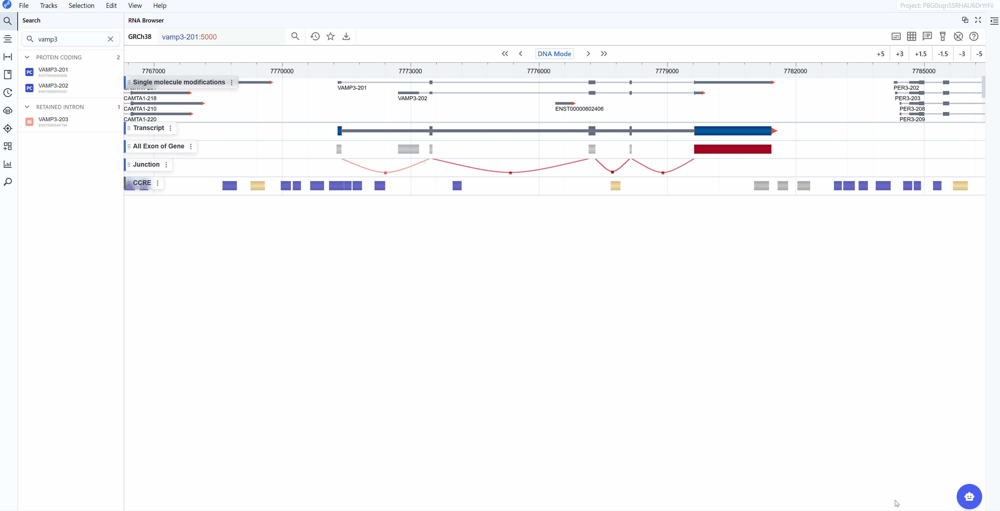
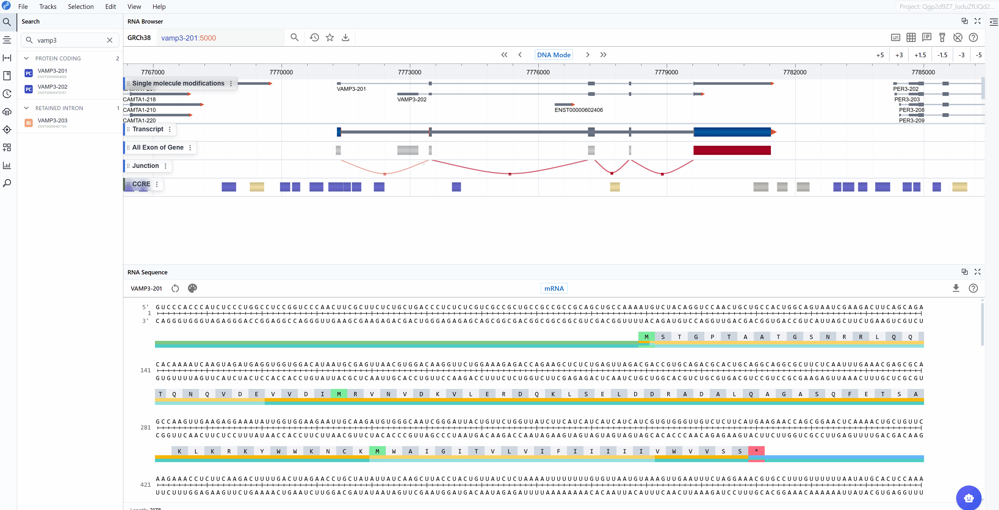

# RNA Sequence Viewer

{ class="cover-image-lg" }

## Overview

The RNA Sequence Viewer provides detailed nucleotide-level visualization of RNA sequences with comprehensive annotations and multiple rendering modes. This plugin enables researchers to examine mRNA and CDS sequences with full structural annotations including UTRs, exons, codons, and their corresponding amino acid translations. Additionally, it displays complementary base-pairing information for each nucleotide, facilitating the design of antisense oligonucleotides (ASOs) and primers. When integrated with the ASO Design plugin, it becomes a powerful toolkit. With flexible color-coding schemes for nucleotide composition analysis (GC content, purine/pyrimidine distribution) and synchronized multi-window comparison capabilities, it serves as an essential tool for sequence analysis, oligonucleotide design, motif identification, and functional element characterization.

## Cross-window Real-time Rendering

The multi-window feature allows you to compare different sequence representations and annotations simultaneously, providing comprehensive views of your transcript of interest.

**How to use multi-window mode:**

1. **Open a new window**: Click the :material-content-copy: button in the plugin interface to create an additional RNA Sequence Viewer window.

2. **Compare rendering modes**: Use different windows to display various sequence rendering modes simultaneously. For example: 
   Window 1: View nucleotide sequence in standard color mode  
   Window 2: Display GC content distribution 

3. **Compare sequence modes**: Open multiple windows with different sequence modes (mRNA vs. CDS) to compare: 
   Full mRNA sequence including UTRs and regulatory elements 
   CDS-only view focusing on protein-coding regions 
   Identify differences in annotation between sequence representations 

4. **Synchronized navigation**: All open windows automatically synchronize to the same transcript ID when you search for or select a transcript in the search box. This ensures that all windows display the same gene for direct comparison.

{ class="cover-image-lg" }

**Cross-plugin synchronization:**

The RNA Sequence Viewer integrates seamlessly with other RBrowser plugins, enabling multi-dimensional analysis of the same transcript region:

- **Synchronized selection**: When you select a region in any plugin window, all other plugin windows (including RNA 2D Structure, RNA 3D Structure, and RNA Sequence) will highlight the same region.
- **Multi-scale analysis**: Examine your region of interest across different representations:Linear view, 2D structure, 3D structure, Single-nucleotide resolution.

This synchronized, multi-plugin approach allows you to comprehensively investigate transcript features from sequence to structure, providing insights that would be difficult to obtain from any single view alone.

{ class="cover-image-lg" }

## Render Mode

The RNA Sequence Viewer offers multiple color-coding schemes to highlight different aspects of nucleotide composition, helping you identify sequence patterns and functional elements relevant to your research question.

**Available render modes:**

### Nucleotide Mode
The standard nucleotide rendering uses conventional color-coding to display the RNA sequence:

- **A (Adenine)**
- **U (Uracil)**
- **G (Guanine)**
- **C (Cytosine)**

This mode is ideal for:

- General sequence examination and reading
- Identifying specific nucleotide patterns or motifs
- Visual comparison of sequence regions
- Locating mutation or variant positions

### GC Content Mode
Highlights guanine (G) and cytosine (C) nucleotides with distinct coloring to emphasize GC-rich regions:

- **G and C nucleotides**
- **A and U nucleotides**

This mode is particularly useful for:

- Identifying GC-rich regions that may form stable secondary structures
- Analyzing promoter regions and CpG islands
- Detecting regions with biased nucleotide composition
- Examining thermodynamic stability patterns (GC pairs are more stable than AU pairs)
- Identifying potential miRNA binding sites (often have specific GC content requirements)

### Purine vs. Pyrimidine Mode
Differentiates between purine bases (A, G) and pyrimidine bases (U, C):

- **Purines (A, G)**: Larger, two-ring bases
- **Pyrimidines (U, C)**: Smaller, single-ring bases

This mode is valuable for:

- Identifying purine-rich or pyrimidine-rich regions (RY-rich tracts)
- Analyzing RNA editing sites (often involve purine-to-purine or pyrimidine-to-pyrimidine changes)
- Detecting sequence bias in regulatory elements
- Examining splice sites (which often have purine/pyrimidine composition patterns)
- Investigating RNA-binding protein recognition motifs (many RBPs have purine or pyrimidine preferences)

**Switching between render modes:**

Click on the render mode selector in the toolbar to cycle through different visualization schemes. The sequence updates in real-time, allowing you to quickly identify regions of interest based on nucleotide composition.

{ class="cover-image" }

## Sequence Mode

The RNA Sequence Viewer provides two complementary sequence display modes to accommodate different research focuses, from studying regulatory elements to analyzing protein-coding sequences.

### mRNA Mode

The mRNA mode displays the complete messenger RNA transcript with comprehensive structural and functional annotations:

**Annotated features:**

- **5' UTR (Untranslated Region)**: The regulatory region upstream of the start codon, important for translation initiation, mRNA localization, and stability
- **Start Codon (AUG)**: The translation initiation site, clearly marked for easy identification
- **Exons**: All exonic sequences including both coding and non-coding exons, helping you understand the gene structure
- **Stop Codon (UAA, UAG, or UGA)**: The translation termination site, marking the end of the protein-coding sequence
- **3' UTR**: The regulatory region downstream of the stop codon, containing elements for mRNA stability, localization, and post-transcriptional regulation
- **Codon triplets**: Three-nucleotide groups with their corresponding amino acid translations displayed
- **Splice junctions**: Boundaries between exons (when viewing genomic context)

**Use cases for mRNA mode:**

- Analyze regulatory elements in UTRs (e.g., upstream ORFs, IRESs, miRNA binding sites)
- Examine the complete transcript structure and isoform differences
- Study post-transcriptional regulatory motifs
- Investigate RNA modifications in non-coding regions
- Analyze mRNA stability determinants

### CDS Mode

The CDS (Coding Sequence) mode focuses exclusively on the protein-coding region, providing a streamlined view optimized for translation analysis:

**Annotated features:**

- **CDS (Coding Sequence)**: The complete protein-coding sequence from start to stop codon
- **Reading frame**: Maintained throughout the sequence for accurate translation
- **Amino acid sequence**: One-letter or three-letter amino acid codes displayed below codons

**Use cases for CDS mode:**

- Analyze codon usage bias and optimization
- Identify synonymous vs. non-synonymous mutations
- Study protein domains at the sequence level
- Examine translation efficiency signals
- Investigate rare codons that may affect expression
- Map protein variants and their genomic positions

### Amino Acid Translation

A key feature available in both sequence modes is the automatic display of amino acid translations for codon triplets. This translation is maintained when switching between mRNA and CDS modes, facilitating:

- **Mutation impact analysis**: Immediately see whether nucleotide changes result in synonymous or non-synonymous substitutions
- **Frameshift detection**: Identify regions where insertions/deletions disrupt the reading frame
- **Protein domain mapping**: Correlate nucleotide sequences with known protein functional domains
- **Stop codon identification**: Quickly locate premature termination codons
- **Codon optimization**: Compare native codons with optimal codons for expression systems

**Switching between sequence modes:**

Use the sequence mode selector in the toolbar to toggle between mRNA and CDS views. The transition is instantaneous, allowing you to quickly compare the same region in different contexts. This is particularly useful when used with the multi-window feature, where you can keep both modes visible simultaneously.

{ class="cover-image" }

---
## Download
This plugin allows you to download the currently adjusted image (PNG, JPEG) as well as the sequence (FASTA) file. Simply click the :material-download: button to start the download.

---

## Best Practices

To maximize your productivity with the RNA Sequence Viewer:

1. **Use multi-window mode strategically**: Open multiple windows with different render modes and sequence modes to gain complementary insights simultaneously.

2. **Combine with structure plugins**: Take advantage of cross-plugin synchronization by using RNA Sequence Viewer alongside RNA 2D Structure and RNA 3D Structure plugins for comprehensive analysis.

3. **Choose the appropriate render mode**: 
   - Use GC Content mode when investigating RNA stability or secondary structure potential
   - Use Purine vs. Pyrimidine mode when examining RBP binding sites or RNA editing patterns
   - Use standard Nucleotide mode for general sequence reading and motif identification

4. **Select the right sequence mode**:
   - Use mRNA mode for regulatory element analysis and full transcript structure investigation
   - Use CDS mode for codon optimization, mutation analysis, and protein-focused studies

5. **Leverage amino acid translations**: Always check the amino acid sequence when analyzing variants or mutations to understand their functional impact.

---

## Troubleshooting

**Issue**: The sequence appears truncated or incomplete.
**Solution**: Check that you've selected the correct transcript isoform. Some isoforms may be incomplete or lack certain regions.

**Issue**: Annotations (UTRs, exons) are not visible.
**Solution**: Verify that the transcript has complete annotations in the database. Zoom in if necessary, as some annotations may not be visible at low zoom levels.

**Issue**: Different windows show different sequences.
**Solution**: Ensure that all windows are synchronized. Search for the same transcript ID in each window to synchronize them.

For additional support, please visit the [Contact](../5_contact/index.md) page.