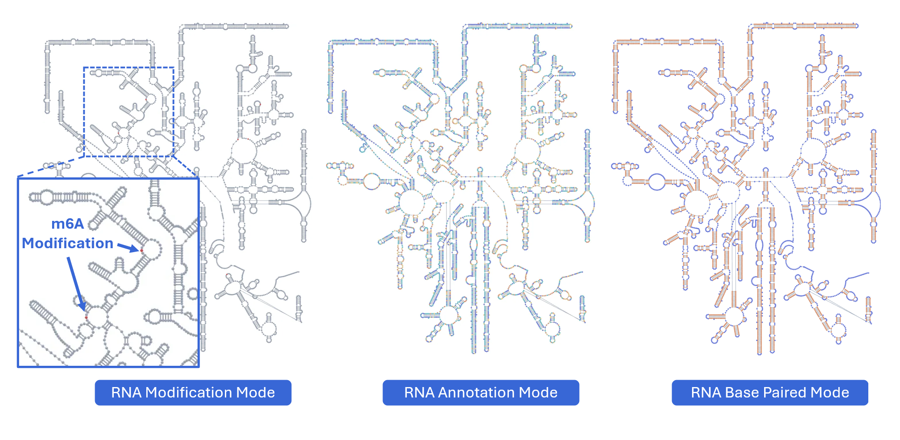
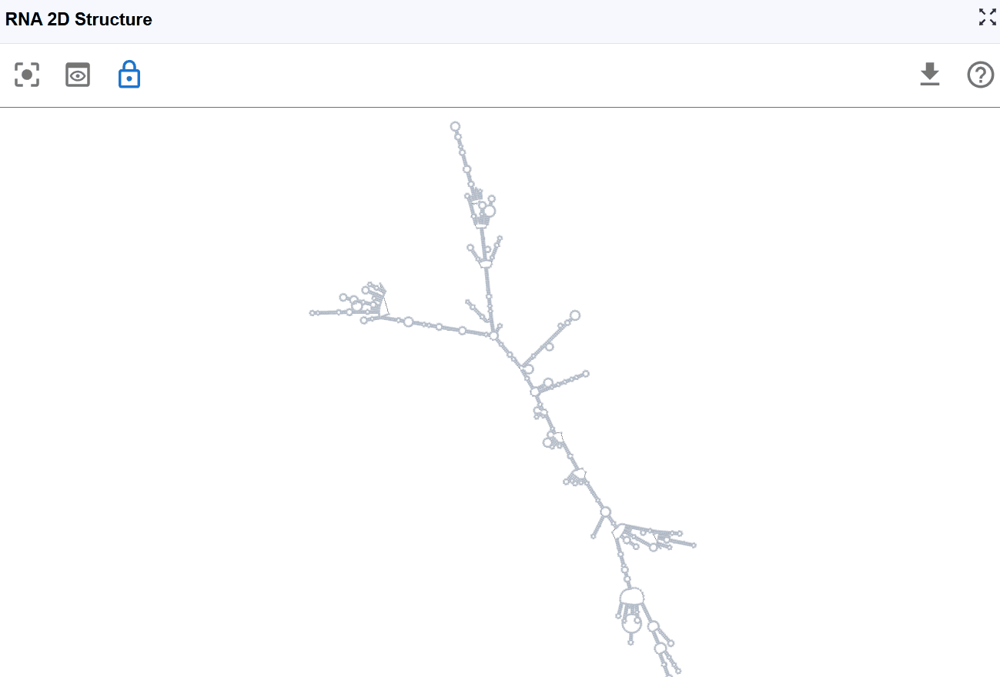
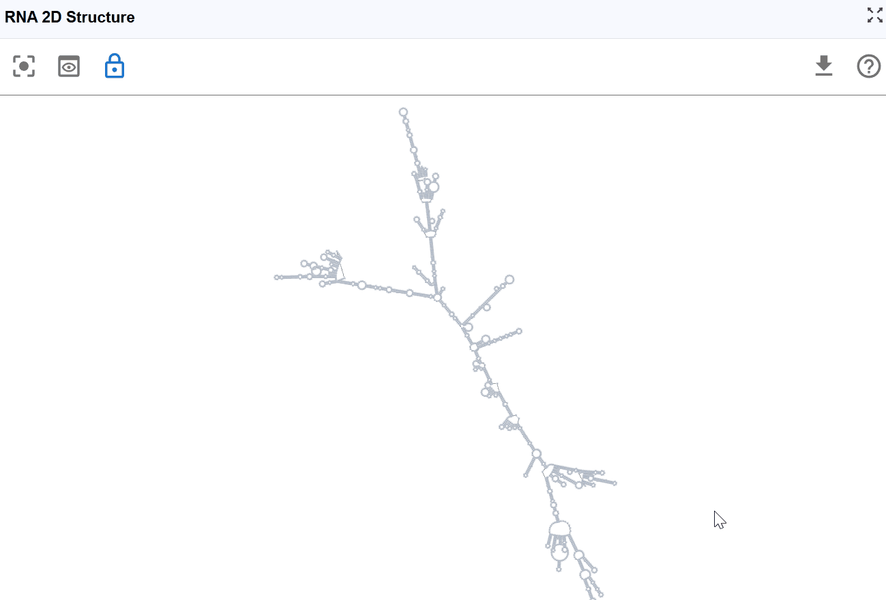
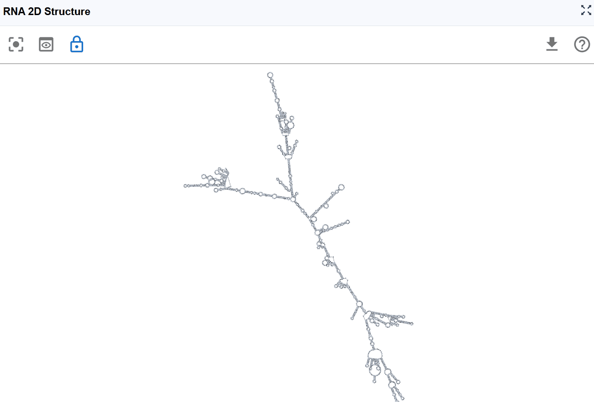

# RNA 2D Structure

{ class="cover-image-lg" }

## Overview

The RNA 2D Structure plugin provides comprehensive visualization of RNA secondary structures with multiple annotation layers. By integrating experimental probing data (such as SHAPE, DMS-seq, and icSHAPE) with computational predictions, this plugin delivers more accurate and biologically relevant structural models compared to purely in silico methods. Users can explore structure-function relationships through various rendering modes including structural annotations, base-pairing patterns, thermodynamic stability (minimum free energy, entropy), pairing probabilities, and RNA modifications mapped onto 2D structures. The plugin uses a novel, RBrowser-defined r2s file format designed for efficient data transmission and rendering. 

---

## Cross-window Real-time Rendering

The RNA 2D Structure plugin supports sophisticated multi-window and cross-plugin synchronization, enabling comprehensive structure-function analysis from multiple perspectives simultaneously.

{ class="cover-image-lg" }

**Multi-window capabilities:**

1. **Open new windows**: Click the :material-content-copy: button to create an additional RNA 2D Structure viewer window with expanded display and enhanced manipulation controls.

2. **Compare rendering modes**: Use different windows to display various annotation modes simultaneously: 
   Window 1: Show structural annotations (stems, loops, hairpins) 
   Window 2: Display thermodynamic parameters (minimum free energy)

3. **Synchronized transcript navigation**: When you search for and select a transcript, all open RNA 2D Structure windows automatically synchronize to display the same transcript, ensuring consistent comparison across views.

**Cross-plugin synchronization:**

The RNA 2D Structure plugin seamlessly integrates with other RBrowser components, providing multi-dimensional structural and functional analysis:

1. **Selection mapping**: When you select a region in the main RBrowser linear track view, that region is automatically highlighted on the 2D structure, showing its structural context (e.g., within a stem-loop, hairpin, or bulge region).

2. **Signal projection**: Linear track signals from the main viewer (such as RNA modification profiles, RNA-seq coverage, or CLIP-seq peaks) are projected in real-time onto the 2D structure, allowing you to visualize how these signals correlate with structural elements.

3. **Multi-scale integration**: Simultaneously examine your region of interest across: 
  Linear genomic view: Genomic context and track signals in the main RBrowser viewer 
  2D structure view: Secondary structure and base-pairing patterns 
  Sequence view: Nucleotide-level details in the RNA Sequence Viewer 
  3D structure view: Three-dimensional spatial arrangement (when available)

This synchronized, multi-dimensional approach enables you to answer complex questions such as: 
  Do RNA modifications preferentially occur in specific structural contexts (e.g., loops vs. stems)? 
  How do RBP binding sites correlate with secondary structure accessibility? 
  Are single nucleotide polymorphisms (SNPs) located in structurally important regions? 
  How do structural elements align with functional domains?

---

## Render Mode

The RNA 2D Structure plugin offers multiple rendering modes that highlight different aspects of RNA structure, from basic structural elements to thermodynamic properties and functional annotations. These complementary views enable comprehensive structural analysis tailored to your research question.

### RNA Structure Annotation Mode

This mode color-codes nucleotides based on their classification within secondary structure elements, providing immediate visual identification of structural motifs that are often functionally significant.

{ class="cover-image" }

**Navigation controls:**

- **Pan the view**: :material-mouse-left-click-outline: Click and drag with the left mouse button to explore different perspectives and reposition the structure  
- **Zoom in/out**: :material-mouse-move-vertical:  Mouse scroll wheel to adjust the zoom level. At higher zoom levels (zoomed out), nucleotide labels are hidden for a cleaner overview. At lower zoom levels (zoomed in), nucleotide names are displayed for detailed examination.

**Structural elements annotated:**

- **`S` (Stem)**: Continuous stretches of Watson-Crick base pairs forming double-stranded helical regions
  - *Functional significance*: Provides structural stability; often involved in protein recognition sites
  
- **`H` (Hairpin)**: Loop regions at the end of a stem, closed by a base-paired stem
  - *Functional significance*: Common sites for protein binding, RNA modifications, and catalytic activity; includes important motifs like GNRA tetraloops
  
- **`I` (Internal loop)**: Unpaired nucleotides within a stem, occurring on both strands
  - *Functional significance*: Creates flexibility and binding pockets; often recognition sites for RBPs and small molecules
  
- **`B` (Bulge)**: Unpaired nucleotides on one strand within a stem
  - *Functional significance*: Introduces structural kinks; can affect RNA stability and create binding sites
  
- **`M` (Multiloop)**: Junction regions where three or more stems converge
  - *Functional significance*: Architectural hubs in complex RNA structures; critical for tertiary structure formation
  
- **`X` (External loop)**: Unpaired regions connecting major structural domains or at transcript termini
  - *Functional significance*: Often contains regulatory elements, protein binding sites, or sites for RNA-RNA interactions
  
- **`E` (Dangling End)**: Single-stranded nucleotides adjacent to stems that contribute to stability
  - *Functional significance*: Can stabilize adjacent helices through stacking interactions

**Use cases:**
- Identify functional motifs (e.g., riboswitches, ribozymes, protein binding sites)

### RNA Structure Mode

This mode provides a simplified, binary classification of nucleotides based on their base-pairing status, offering clear visualization of single-stranded versus double-stranded regions to support structure-function analysis.

**Classification:**

- **Paired nucleotides**: Bases involved in Watson-Crick base pairs (A-U, G-C) or wobble pairs (G-U), shown in one color
- **Unpaired nucleotides**: Single-stranded bases not engaged in base pairing, shown in a contrasting color

**Use cases:**

- **Identify accessible regions**: Single-stranded regions are more accessible to proteins, antisense oligonucleotides, and chemical modifications
- **Evaluate structural stability**: Higher proportion of paired bases generally indicates more stable structures
- **Design RNA probes**: Target single-stranded regions for FISH probes or antisense therapies
- **Assess structural differences**: Quickly compare paired vs. unpaired regions between different structures or conditions
- **Identify potential binding sites**: Many RNA-binding proteins preferentially bind single-stranded regions

{ class="cover-image" }

### Sequence Mode

This mode displays the RNA sequence using standard nucleotide color-coding, allowing you to examine sequence patterns in the context of secondary structure.

**Nucleotide coloring:**

- **A (Adenine)**
- **U (Uracil)**
- **G (Guanine)**
- **C (Cytosine)**

**Use cases:**

- **Identify sequence motifs**: Locate specific sequences (e.g., GNRA tetraloops, UNCG hairpins) within the structural context
- **Analyze base composition**: Observe purine/pyrimidine distribution across structural elements
- **Examine mutations**: Visualize the structural location of variant nucleotides
- **Study sequence-structure relationships**: Understand how sequence determines structure formation
- **Design mutagenesis experiments**: Plan substitutions while considering structural context

{ class="cover-image" }

### GC Content Mode

This mode highlights guanine (G) and cytosine (C) nucleotides to emphasize GC-rich regions within the secondary structure, which are important for structural stability and thermodynamic properties.

**Visualization:**

- **G and C nucleotides**
- **A and U nucleotides**

**Biological and structural significance:**

- **Thermodynamic stability**: G-C base pairs form three hydrogen bonds (compared to two for A-U pairs), making GC-rich regions more thermodynamically stable
- **Structural rigidity**: GC-rich stems are typically more rigid and resistant to thermal denaturation
- **Evolutionary conservation**: GC-rich structural elements are often functionally important and evolutionarily conserved

**Use cases:**

- **Assess structural stability**: Identify the most thermodynamically stable regions of the structure
- **Predict melting behavior**: GC-rich regions will denature at higher temperatures
- **Analyze experimental probing data**: GC-rich stems may be more resistant to chemical probes
- **Design RNA therapeutics**: Consider GC content when designing stable antisense oligonucleotides
- **Compare structural elements**: Evaluate whether specific structural motifs (e.g., certain hairpins) are GC-rich or AU-rich
- **Identify potential G-quadruplex regions**: Multiple consecutive guanines may form alternative structures

{ class="cover-image" }

### Pairing Probabilities Mode

{ class="cover-image" }

This mode visualizes the statistical confidence of each base pair using pairing probability scores computed by RNAfold from the ViennaRNA package. The color gradient indicates the likelihood that each base pair exists in the ensemble of possible structures.

Pairing probabilities reflect the thermodynamic ensemble of RNA structures at equilibrium. RNA molecules exist in a dynamic equilibrium of multiple conformations, and this mode reveals:

- **Structural flexibility**: Regions with low pairing probabilities are more structurally dynamic
- **Alternative structures**: Low probabilities may indicate competing base-pairing patterns
- **Functional conformational switches**: Some RNAs (e.g., riboswitches) rely on structural plasticity for function

### Minimum Free Energy (MFE) Mode

This mode color-codes nucleotides based on their contribution to the overall thermodynamic stability of the RNA structure, using minimum free energy values calculated by RNAfold from the ViennaRNA package.

{ class="cover-image" }

- **Highly stable (very negative ΔG)**: These positions contribute significantly to overall structural stability. Indicates favorable, stabilizing interactions (hydrogen bonds, base stacking)
  
- **Moderately stable**: These positions provide moderate stabilization
  
- **Unstable or neutral**: These positions contribute little to stability or may even destabilize the structure. Indicates unfavorable or neutral contributions.

- **Identify stabilizing elements**: Locate the most thermodynamically important base pairs and stacking interactions
- **Predict structural stability**: Assess overall structure robustness based on MFE distribution
- **Design structure-stabilizing mutations**: Strengthen weak points by introducing more favorable base pairs
- **Evaluate structure-destabilizing mutations**: Predict how variants might affect overall stability
- **Compare alternative structures**: Structures with more negative MFE are generally more favorable
- **Understand melting behavior**: Predict which regions will denature first under stress conditions
- **Guide experimental design**: Design mutations or antisense oligonucleotides targeting specific stability regions

### Entropy Mode

This mode visualizes the conformational entropy of each nucleotide position, quantifying the structural uncertainty or flexibility based on calculations from RNAfold's partition function analysis.

{ class="cover-image" }

- **High entropy**: Nucleotides that adopt many different conformations in the structural ensemble. These positions are structurally flexible and dynamic. High uncertainty in the structure at these positions
  
- **Moderate entropy**: Positions with moderate conformational diversity
  
- **Low entropy**: Nucleotides that consistently adopt the same conformation. These positions are structurally rigid and well-defined. High confidence in the structure at these positions.

!!! tip
    Positional entropy (S) relates to the number of accessible microstates for each nucleotide:
    High entropy indicates many possible conformations with similar probabilities
    Low entropy indicates few accessible conformations, with one dominant structure

### RNA Modification Mode

This powerful mode integrates functional genomics data with structural information by projecting one-dimensional signal tracks (from the main RBrowser linear viewer) onto the 2D RNA structure, enabling structure-function correlation analysis.

---

## Reset View

After extensive exploration through zooming, panning, and layout adjustments, you may want to return to the default view configuration.

{ class="cover-image" }

## Download Structure

The RNA 2D Structure plugin allows you to export the current structure view for use in publications, presentations, or further analysis.

**Export options:**

- **Image formats**: Export high-resolution images (PNG, JPEG) of the current structure view with your selected rendering mode
- **Structure files**:Download in RBrowser's r2s format for efficient sharing and reloading

---

## Best Practices

To maximize your analysis with the RNA 2D Structure plugin:

1. **Start with structure annotation mode**: Get an overview of the structural elements before diving into detailed analysis

2. **Use pairing probabilities**: Assess the confidence of structure predictions before drawing conclusions

3. **Combine multiple render modes**: Use multi-window mode to simultaneously view structure annotations, thermodynamic parameters, and functional data

4. **Integrate with experimental data**: Project chemical probing or modification data onto structures to validate predictions

5. **Cross-reference with other plugins**: Use synchronized selection with RNA Sequence Viewer and RNA 3D Structure for comprehensive analysis

6. **Consider entropy for dynamics**: High entropy regions may be functionally important sites of conformational change

7. **Validate with GC content**: Compare thermodynamic predictions with expected stability based on GC content

---

## Troubleshooting

**Issue**: Structure appears distorted or overlapping.
**Solution**: Click the reset button to restore the default layout. If problems persist, try reloading the structure file.

**Issue**: RNA modification signals don't appear on the structure.
**Solution**: Ensure that the track data is loaded in the main RBrowser viewer and that you've selected the correct track in the RNA Modification Mode menu.

**Issue**: Pairing probabilities show mostly low values.
**Solution**: This may indicate an intrinsically flexible structure or an ambiguous prediction. Consider integrating experimental probing data or examining alternative structures.

**Issue**: Different structure predictions show different folds.
**Solution**: This is common for structurally ambiguous RNAs. Use pairing probabilities and entropy modes to identify well-defined vs. uncertain regions. Experimental data can help resolve ambiguities.

**Issue**: Structure doesn't synchronize with other plugin windows.
**Solution**: Verify that all windows are displaying the same transcript ID. Use the transcript search to ensure synchronization.

For additional support, please visit the [Contact](../5_contact/index.md) page.