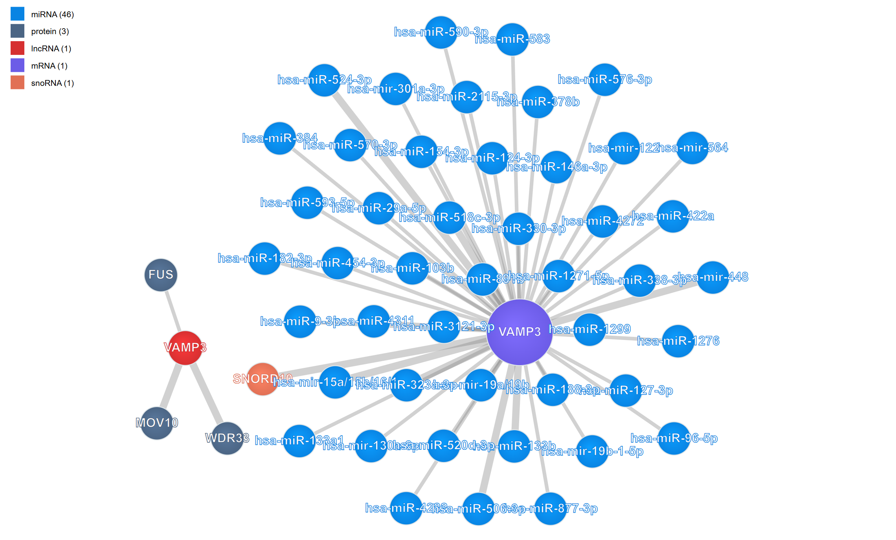

# RNA Interaction Viewer

{ class="cover-image-lg" }

## Overview

### RNA–Protein Interaction  
Integrates CLIP-seq and eCLIP datasets to map RNA-binding protein (RBP) binding sites, revealing key RNA regulatory elements and RBP–mRNA interaction landscapes.

### RNA–RNA Interaction  
Visualizes long-range RNA–RNA interactions, including miRNA–mRNA targeting, lncRNA-mediated regulation, and RNA duplex formation.

### RNA–DNA Interaction  
Supports the integration of chromatin-associated RNA (caRNA) datasets, allowing exploration of RNA–chromatin interactions and their roles in transcriptional regulation.

---

## Usage

The network plugin provides detailed **node annotations** and **interaction metadata**.  
Each interaction includes information on the **specific tissue or cell line**, **experimental method**, and **data resource ID**.

- Global zooming and panning are supported.  
- Hover or click on a **node** to view its detailed annotation.  
- Hover or click on an **interaction link** to reveal associated metadata, including tissue/cell type, experiment, and data source.

{ class="cover-image-lg" }