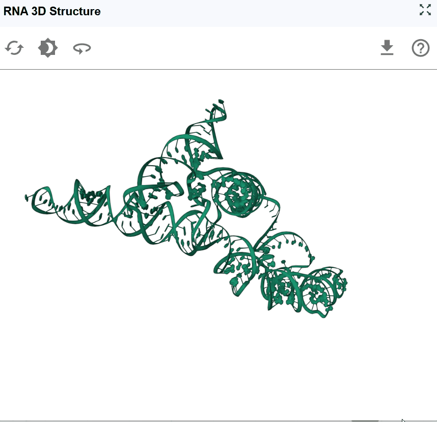
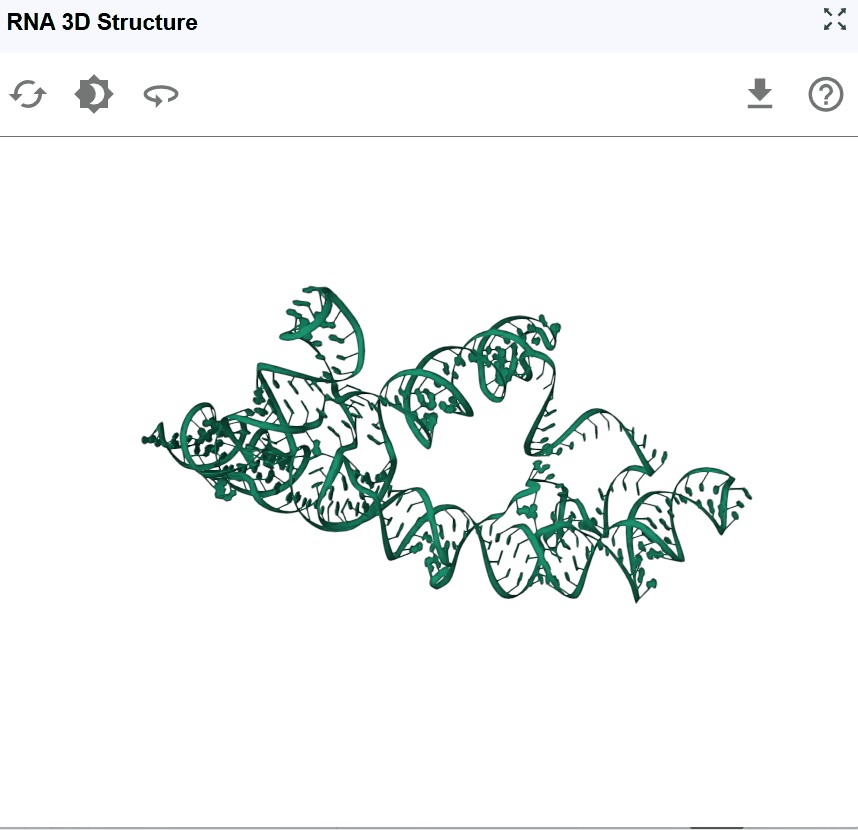
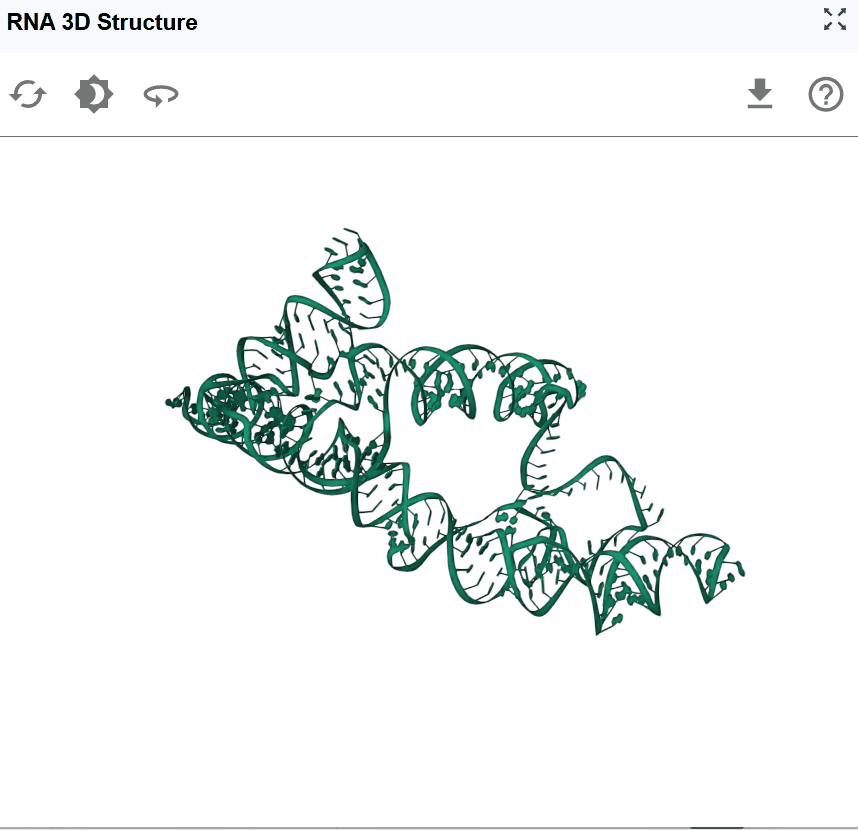
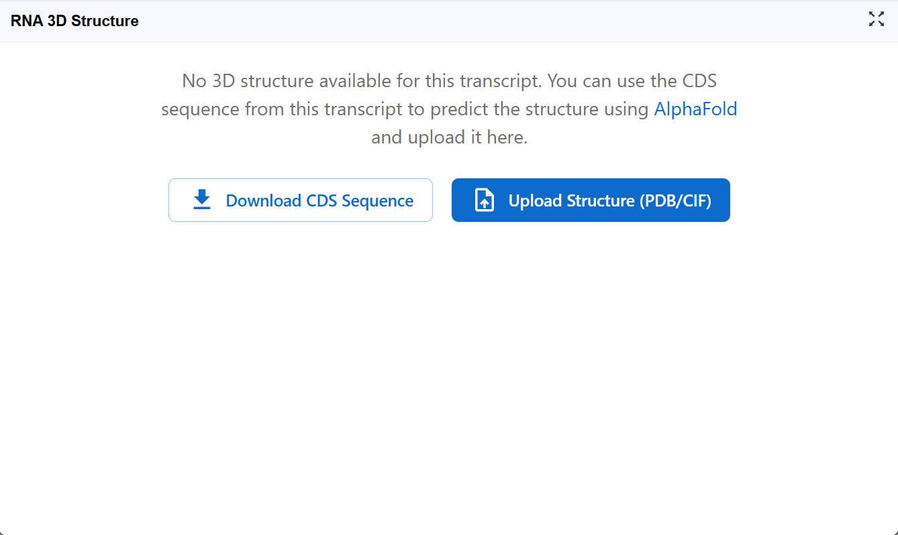
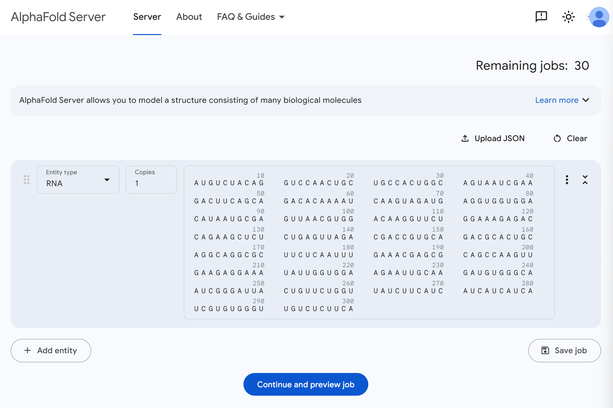
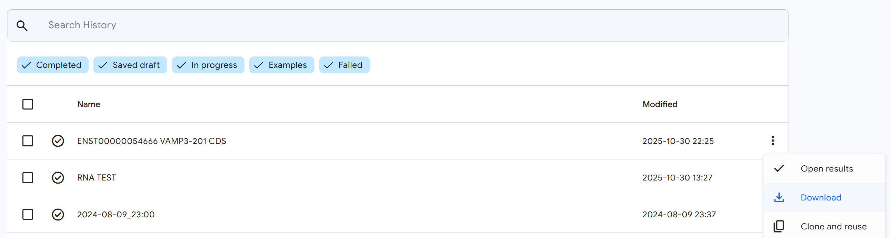
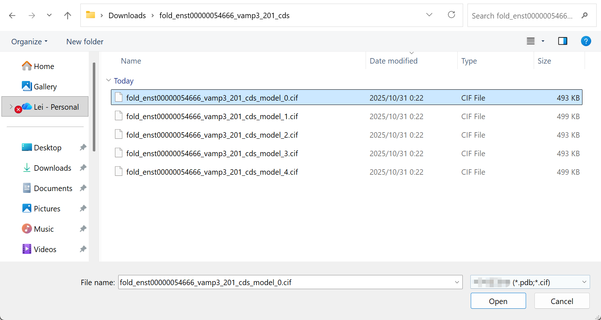
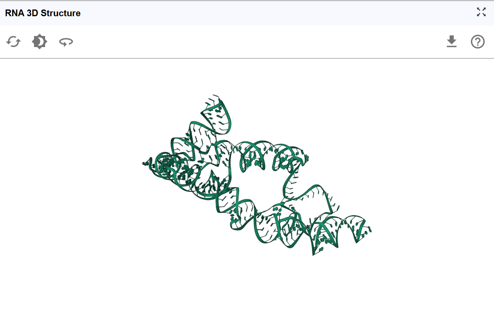

# RNA 3D Structure

{ class="cover-image-lg" }

## Overview

The RNA 3D Structure plugin provides interactive visualization of three-dimensional RNA architectures, enabling researchers to explore spatial arrangements, tertiary interactions, and structural motifs that are critical for RNA function. By integrating experimentally determined structures from the Protein Data Bank (PDB) and AI-predicted models from AlphaFold, this plugin bridges the gap between sequence, secondary structure, and three-dimensional conformation. The plugin supports multiple visualization styles, synchronized selection with other RBrowser components, and custom structure uploads for comparative analysis. With intuitive navigation controls and cross-plugin integration, users can examine RNA structures at atomic resolution while correlating 3D architecture with functional genomics data.

## Cross-window Real-time Rendering

The RNA 3D Structure plugin supports multi-window visualization and seamless synchronization with other RBrowser plugins, enabling comprehensive structural analysis from multiple angles and scales.

**Multi-window capabilities:**

1. **Open new windows**: Click the :material-content-copy: button to create additional 3D structure viewer window

2. **Synchronized transcript navigation**: When you search for a transcript in one window, all open RNA 3D Structure windows automatically synchronize to display the same transcript, ensuring consistent analysis across views.

**Cross-plugin synchronization:**

The RNA 3D Structure plugin integrates seamlessly with other RBrowser components for multi-dimensional structure-function analysis:

- **Selection mapping**: When you select a region in any RBrowser plugin (linear track view, 2D structure, or sequence viewer), that region is automatically highlighted in the 3D structure, showing its spatial location and tertiary context.

- **Multi-scale structural analysis**: Simultaneously examine your region of interest across different structural representations: 
  **Linear genomic view**: Genomic context and functional tracks 
  **Sequence view**: Nucleotide-level details with complementary base information 
  **2D structure view**: Secondary structure and base-pairing patterns 
  **3D structure view**: Atomic-level spatial arrangement and tertiary interactions

This synchronized approach enables you to answer complex structural questions such as: 
  How do RNA modifications affect local 3D structure? 
  Are RBP binding sites located in accessible surface regions? 
  Do mutations disrupt tertiary contacts or structural stability? 
  How do secondary structure elements fold into 3D space?

{ class="cover-image-lg" }

## Interactive Controls

### Navigation and Viewing

The RNA 3D Structure viewer provides intuitive controls for exploring RNA structures from any angle and zoom level.

**Basic navigation:**

- **Rotate the structure**: :material-mouse-left-click-outline: Click and drag with the left mouse button to rotate the structure in 3D space. This allows you to examine the structure from any perspective and identify spatial relationships between distant regions.

- **Pan the view**: :material-mouse-left-click-outline: Hold and drag to reposition the structure within the viewing window without changing its orientation.

- **Zoom in/out**: :material-mouse-move-vertical: Use the mouse scroll wheel to adjust the zoom level: 
  Zoomed out (higher level): Nucleotide labels are hidden for a cleaner, global view of the overall architecture 
  Zoomed in (lower level): Nucleotide names and atomic details are displayed for detailed structural examination

**Use cases for different viewing angles:**

- **Side view**: Examine the overall shape and major structural domains
- **Top/bottom view**: Assess the spatial arrangement of helices and loops
- **Close-up examination**: Zoom in to inspect specific base-pairing, stacking interactions, or tertiary contacts
- **Global overview**: Zoom out to understand the overall fold and domain organization

### Reset View

After extensive rotation, panning, and zooming, you may want to return to the default viewing configuration for a fresh perspective.
Click the reset button to restore default view settings:

{ class="cover-image" }

### Background Color

Customize the viewer background to optimize visualization for different purposes and preferences.

**Available background options:**

The background color toggle allows you to switch between different background colors:

- **Publication figures**: White backgrounds are typically preferred for journal submissions
- **Presentations**: Black backgrounds can be more effective for slide presentations in dark rooms
- **Screenshot preparation**: Select the background that best highlights your structural features of interest

{ class="cover-image" }

### Automatic Rotation (Spin)

The spin feature enables continuous automatic rotation of the structure, allowing hands-free observation of the RNA architecture from all angles.
Click the spin button to start automatic rotation. Click the spin button again to stop the rotation at the current angle.

{ class="cover-image" }

!!! tips
    Use in multi-window mode to compare structures while one rotates.

### Download Structure and Images

Export the current 3D structure view for use in publications, presentations, further analysis, or structural modeling.

**Download options:**

1. **High-resolution images**: Capture the current view as a publication-quality PNG/JPEG image.

2. **Structure files**: Download the 3D coordinates for use in other molecular visualization or modeling software

{ class="cover-image" }

## Predicting RNA 3D Structures with AlphaFold

For RNAs without experimentally determined structures, you can generate AI-predicted 3D models using AlphaFold and seamlessly integrate them into RBrowser for analysis.

### Why Use AlphaFold for RNA Structure Prediction?

AlphaFold (specifically AlphaFold 3 and later versions with RNA support) has revolutionized structural biology by providing accurate 3D structure predictions based solely on sequence information. For RNA structures:

- **No experimental data required**: Predict structures for any RNA sequence
- **Fast predictions**: Obtain structural models in minutes to hours
- **Confidence scores**: Evaluate prediction reliability for each region
- **Complement experimental data**: Generate models for RNAs lacking PDB structures

Due to computational resource limitations on the RBrowser platform, we recommend using the official AlphaFold Server for structure prediction. Don't worry—the process is straightforward, and RBrowser provides all necessary sequence information to make the workflow seamless.

### Step 1: Download the RNA Sequence

If your transcript of interest displays the message shown below, it means we currently don't have a 3D structure file available for this RNA in our database.

{ class="cover-image" }

**Action required:**

Click the **`Download CDS Sequence`** button to download the coding sequence in FASTA format. This sequence will be used as input for AlphaFold structure prediction.

**Note**: For non-coding RNAs or full-length transcripts, you may need to download the appropriate sequence region from the RNA Sequence Viewer plugin.

### Step 2: Submit Structure Prediction to AlphaFold Server

Navigate to the [AlphaFold Server](https://alphafoldserver.com/) and create a new prediction job.

**Setup your prediction:**

1. **Start a new job**: Click on "New Prediction" or similar button to begin
2. **Select entity type**: Choose **RNA** as the entity type (critical for proper structure prediction)
3. **Input sequence**: Paste the sequence you downloaded from RBrowser in FASTA format
4. **Review input**: The interface should now display your RNA sequence

Your setup should look similar to the image below. Once everything looks correct, click **`Continue and preview job`** to proceed to the next step.

{ class="cover-image" }

!!! tips
    **Account required**: You may need to create a free AlphaFold Server account
    **Sequence length**: AlphaFold performs best on sequences up to ~2000 nucleotides
    **Check sequence format**: Ensure the sequence contains only valid RNA nucleotides (A, U, G, C)

### Step 3: Confirm and Submit the Prediction Job

Review your job settings and sequence information one final time. Everything looks good? Click **`Confirm and submit job`** to start the structure prediction.

{ class="cover-image" }

**Job processing:**

Once submitted, AlphaFold will begin processing your RNA structure prediction. This is a good time to take a coffee break! ☕

**Prediction time estimates:**

- **Short RNAs (<100 nt)**: Minutes to tens of minutes
- **Medium RNAs (100-500 nt)**: 30 minutes to 2 hours
- **Long RNAs (>500 nt)**: Several hours

You'll typically receive an email notification when the prediction is complete.

### Step 4: Download the Predicted Structure

Once your prediction job is complete, return to the AlphaFold Server results page.

**Download the structure file:**

1. Click the :material-dots-vertical: (three-dot menu) button on your completed job
2. In the dropdown menu, click the **`Download`** button
3. Save the RNA 3D structure file (typically in PDB or CIF format) to your computer

{ class="cover-image" }

### Step 5: Upload the Structure to RBrowser

Now return to the RNA 3D Structure plugin in RBrowser to visualize your predicted structure.

**Upload your structure:**

1. Click the **`Upload Structure (PDB/CIF)`** button in the RNA 3D Structure plugin
2. Select the structure file you downloaded from AlphaFold Server
3. The upload dialog will appear

{ class="cover-image" }

### Step 6: Select a Predicted Model

If AlphaFold generated multiple structural models (common for longer or more complex RNAs).

**Choose your model:**

- AlphaFold typically ranks models by confidence, with Model 1 usually being the highest confidence prediction
- Review the confidence scores if available
- Select the model you wish to visualize
- You can always upload and compare different models using multi-window mode

{ class="cover-image" }

### Step 7: Explore Your Predicted Structure

Success! You now have your AI-predicted RNA 3D structure loaded in RBrowser. The structure is fully integrated with all RBrowser features and plugins.

{ class="cover-image" }

**Integration with other plugins:**

Your predicted structure now works seamlessly with:

- **RNA Sequence Viewer**: Select nucleotides in the sequence and see them highlighted in 3D
- **RNA 2D Structure**: Compare secondary structure predictions with the 3D fold
- **RNA Modification Atlas**: Visualize where modifications occur in 3D space
- **RNA Interaction Viewer**: Understand binding sites in their structural context
- **ASO Design**: Design antisense oligonucleotides targeting accessible structural regions

The integrated RBrowser environment allows you to leverage your predicted 3D structure alongside functional genomics data, accelerating your RNA research and hypothesis generation.

---

## Best Practices

To maximize your analysis with the RNA 3D Structure plugin:

- **Use multiple views**: Open multiple windows to compare different structural models or viewing angles simultaneously

- **Integrate with other plugins**: Take full advantage of synchronized selection to correlate 3D structure with sequence features, modifications, and binding sites

- **Compare with homologs**: If available, compare your structure with experimentally determined structures of homologous RNAs

---

## Troubleshooting

**Issue**: Structure file fails to upload.
**Solution**: Ensure the file is in valid PDB or CIF format. Try opening it in a text editor to verify it's not corrupted. Some very large files may exceed size limits.

**Issue**: Structure appears distorted or incomplete.
**Solution**: This may indicate low-confidence predictions. Check AlphaFold confidence scores. For regions with pLDDT <50, the structure is likely unreliable.

**Issue**: Selected regions don't synchronize with other plugins.
**Solution**: Verify that the sequence in the structure file matches the transcript sequence. Ensure all plugins are displaying the same transcript ID.

**Issue**: AlphaFold prediction takes very long or fails.
**Solution**: Very long RNA sequences (>2000 nt) may timeout or fail. Consider predicting individual domains or smaller segments separately.

**Issue**: Structure doesn't match expected 2D structure.
**Solution**: This may indicate alternative folding or prediction errors. Compare confidence scores with 2D structure predictions. Experimental probing data can help validate the correct structure.

For additional support, please visit the [Contact](../5_contact/index.md) page.