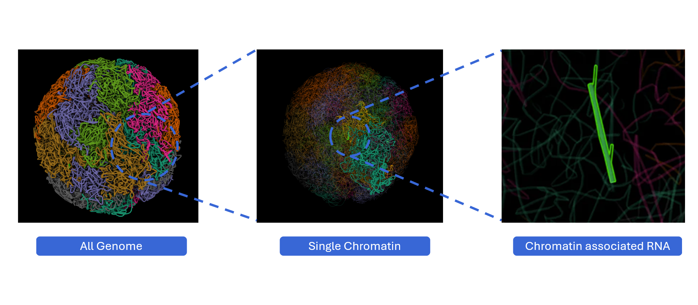
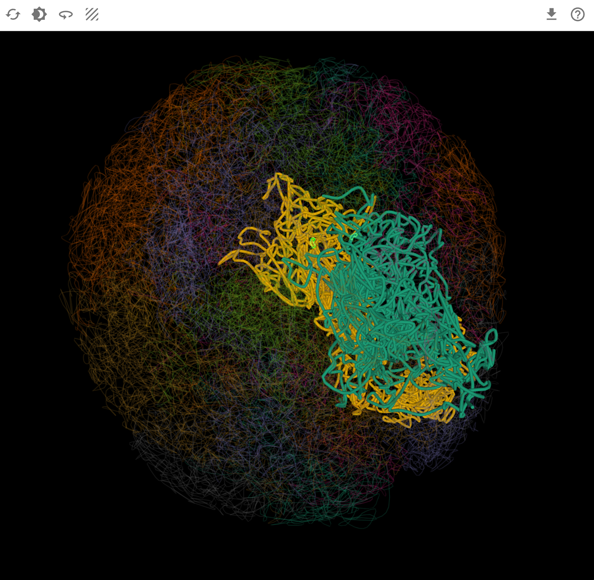

# RNA and Chromatin

{ class="cover-image-lg" }

## Overview

The RNA and Chromatin plugin provides interactive 3D visualization of chromatin-associated RNAs (caRNAs) in the context of three-dimensional genome organization. By integrating Hi-C chromatin conformation data with RNA localization information, this plugin enables researchers to explore how RNAs interact with chromatin structure and contribute to nuclear organization, transcriptional regulation, and epigenetic control. Users can visualize RNA-chromatin associations at multiple scales—from whole-genome topology to chromosome territories to individual caRNA loci—revealing spatial relationships between RNA molecules and their genomic targets. With multi-window comparison capabilities and synchronized navigation, this plugin serves as a powerful tool for understanding the spatial dimension of RNA-mediated gene regulation.

## Cross-window Real-time Rendering

The RNA and Chromatin plugin supports multi-scale, multi-window visualization, enabling comprehensive exploration of RNA-chromatin interactions from global nuclear architecture to local genomic loci.

{ class="cover-image-lg" }

1. **Open new windows**: Click the :material-content-copy: button to create additional viewer windows with expanded display for detailed exploration of RNA positioning within the 3D genome.

2. **Multi-scale visualization**: Different windows can simultaneously display the model at three distinct scales, providing hierarchical context:
   
    - **Whole-genome level**: Global view of all chromosomes in nuclear space
    - **Chromosome level**: Focus on individual chromosome architecture
    - **caRNA level**: Detailed view of chromatin-associated RNA loci

3. **Synchronized navigation**: When you switch transcripts or select genomic regions, all open windows automatically synchronize to display consistent data and focus on the corresponding spatial position in the 3D genome. This ensures that:
    - All views show the same transcript or region
    - The 3D position is highlighted across all scale levels
    - Cross-scale relationships are immediately visible

## Features and Usage

{ class="cover-image" }

### Navigation Controls

The RNA and Chromatin viewer provides intuitive 3D navigation tools for exploring the spatial organization of chromosomes and RNA associations.

**Basic navigation:**

- **Rotate**: :material-mouse-left-click-outline: Click and drag with the left mouse button to rotate the 3D genome view, allowing you to examine chromosome arrangements and RNA positions from any angle
- **Pan**: :material-mouse-move: Drag to reposition the view without changing orientation
- **Zoom**: :material-mouse-move-vertical: Use the mouse scroll wheel to zoom in for detailed examination or zoom out for global overview

**Navigation strategies:**

- **Global exploration**: Rotate at genome level to understand overall chromosome territory organization
- **Regional focus**: Zoom into specific chromosomes to examine TAD structure and RNA enrichment
- **Spatial relationships**: Use rotation to assess 3D distances between caRNA sites and their target loci
- **Context switching**: Quickly zoom between scales to maintain spatial context

### Reset View

After extensive exploration, restore the default viewing configuration to return to a standard perspective. You can click reset button to its orginal view.

### Background Color

Customize the viewer background to optimize visualization for different purposes.

**Use cases:**

- **Presentations**: Black backgrounds work well in dark presentation rooms
- **High contrast**: Select backgrounds that maximize visibility of chromosome and RNA structures

### Automatic Rotation (Spin)

Enable continuous automatic rotation to observe the 3D genome organization from all angles without manual manipulation. Click the spin button to start continuous rotation. Click again to stop at the current angle

### Texture and Visualization Styles

Customize the visual representation of chromosomes and RNA associations to highlight different aspects of 3D genome organization.

### Download and Export

Save your current view and data for publications, presentations, or further analysis.

**Workflow for publication figures:**

1. Navigate to your region/transcript of interest
2. Select the appropriate scale level (genome/chromosome/caRNA)
3. Choose texture mode that highlights your findings
4. Rotate to the most informative viewing angle
5. Set white background for print compatibility
6. Click download and select high-resolution PNG
7. Add labels and annotations in your graphics editor

---

## Understanding RNA-Chromatin Biology

### Chromatin-Associated RNAs (caRNAs)

Chromatin-associated RNAs represent a diverse class of RNA molecules that interact with chromosomal DNA and play crucial roles in:

- **Transcriptional regulation**: lncRNAs recruiting chromatin-modifying complexes to specific loci
- **Chromatin organization**: RNAs facilitating chromatin looping and domain formation
- **Epigenetic control**: RNA-mediated recruitment of histone modifiers and DNA methyltransferases
- **Nuclear organization**: RNAs contributing to nuclear body formation and chromosome territory establishment
- **X-chromosome inactivation**: Xist RNA coating and silencing of the X chromosome

---

## Best Practices

To maximize your analysis with the RNA and Chromatin plugin:

1. **Start at genome level**: Get oriented with overall chromosome organization before zooming in
2. **Use multi-window mode**: Keep context windows open at different scales
3. **Leverage synchronization**: Select regions in other plugins to see 3D genomic context
4. **Rotate extensively**: 3D relationships are not always apparent from a single angle

---

## Troubleshooting

**Issue**: Chromosomes appear tangled or overlapping excessively.
**Solution**: This may reflect biological reality (chromosomes do overlap) or model limitations. Try rotating to different angles. Reset view if navigation has distorted the display.

**Issue**: Cannot locate my caRNA of interest.
**Solution**: Ensure the RNA is present in the loaded dataset. Not all RNAs have chromatin association data. Check data availability for your transcript.

**Issue**: Synchronization with other plugins doesn't highlight expected regions.
**Solution**: Verify that genomic coordinates match between plugins. Some caRNAs may bind to regions not covered by all datasets.

**Issue**: Performance is slow when viewing whole genome.
**Solution**: Displaying all chromosomes simultaneously is computationally intensive. Try viewing at chromosome level or reduce texture complexity.

For additional support, please visit the [Contact](../5_contact/index.md) page.
