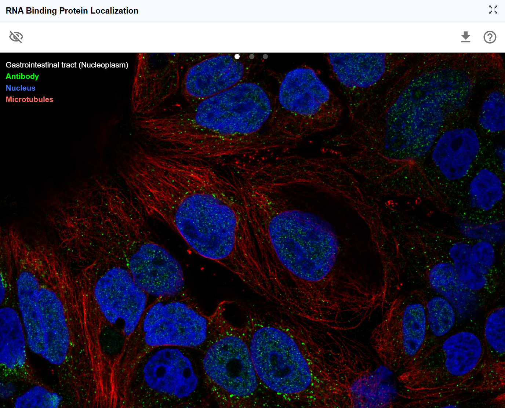

# Subcellular Localization

{ class="cover-image-lg" }

## Overview

The Subcellular Localization plugin visualizes the spatial distribution of RNA-binding proteins (RBPs) and other RNA-associated proteins across cellular compartments using immunofluorescence imaging data. Understanding where proteins localize within the cell is crucial for interpreting their biological functions, as protein localization often dictates regulatory activity, binding partner accessibility, and functional specificity. By integrating high-resolution fluorescence microscopy data from resources like the Human Protein Atlas, this plugin enables researchers to correlate RNA-protein interactions with protein localization patterns, providing spatial context for understanding post-transcriptional regulation, RNA metabolism, and cellular organization.

## Cross-window Real-time Rendering

The Subcellular Localization plugin provides synchronized visualization of protein localization patterns in response to transcript selection, creating an integrated view of RNA-protein biology.

**Multi-window capabilities:**

1. **Open new windows**: Click the :material-content-copy: button to create additional localization viewer windows with expanded display area for detailed examination of fluorescence images.

2. **Larger viewing area**: The new window provides a more spacious canvas for:
    - Examining fine subcellular structures (nucleoli, membrane contacts, cytoplasmic granules)
    - Viewing multiple cell examples simultaneously
    - Comparing localization patterns across different cell cycle stages
    - Assessing localization variability within cell populations

**Synchronized transcript-protein linking:**

When you search for a transcript ID in RBrowser, the Subcellular Localization plugin automatically displays the localization pattern of the corresponding translated protein.

**Integration with RNA biology:**

This synchronized approach enables powerful correlative analyses:

- Do RBPs with nuclear localization preferentially bind nuclear-enriched RNAs?
- Are cytoplasmic RBPs associated with translation-related functions?
- Do shuttling proteins (nuclear-cytoplasmic) regulate RNA export or localization?
- Are RNA modifications enriched in transcripts whose encoded proteins localize to specific compartments?

{ class="cover-image-lg" }

## Interactive Features

{ class="cover-image" }

### Navigation and Image Manipulation Controls

The Subcellular Localization viewer provides comprehensive image manipulation tools for optimal viewing and analysis of fluorescence microscopy data.

**Activating the control toolbar:**

Click anywhere on the fluorescence image to activate the operation toolbar. The toolbar provides multiple transformation options:

**Available transformations:**

1. **Vertical flip (Mirror Y-axis)**: Flip the image top-to-bottom

2. **Horizontal flip (Mirror X-axis)**: Flip the image left-to-right

3. **Rotate right (Clockwise 90°)**: Rotate the image 90 degrees clockwise

4. **Rotate left (Counter-clockwise 90°)**: Rotate the image 90 degrees counter-clockwise

5. **Zoom in (+)**: Magnify the image for detailed examination
   - Useful for: Examining fine subcellular structures (nuclear speckles, stress granules, focal adhesions)
   - Application: Assessing localization patterns at high resolution

6. **Zoom out (-)**: Reduce magnification for broader context
   - Useful for: Viewing entire cells or multiple cells simultaneously
   - Application: Understanding overall localization patterns

**Pan and explore:**

In addition to toolbar controls, you can use mouse interactions:

- **Click and drag**: Pan across the image to explore different regions without changing zoom or orientation
- **Free exploration**: Navigate to areas of interest, such as specific subcellular compartments or individual cells showing interesting localization patterns

**Workflow for image examination:**

1. Click the image to activate the toolbar
2. Use rotation and flip to orient the image optimally
3. Zoom in to examine subcellular details
4. Pan to explore different cells or regions
5. Zoom out to regain context
6. Reset orientation if needed by reloading

### Show/Hide Legend

Control the visibility of annotation legends and labels to optimize viewing of the fluorescence images.

**Legend information typically includes:**

- **Cellular compartments**: Nucleus, cytoplasm, membrane, etc.
- **Fluorescence channels**: Which colors represent which markers
- **Scale bars**: Physical dimensions for size reference
- **Staining information**: antibodies or probes were used

### Download Fluorescence Images

Export high-quality fluorescence images for use in publications, presentations, or further analysis.Click the download button to save the current view.

---

## Understanding Subcellular Localization Patterns

### Common Localization Patterns and Their Functional Implications

**Nuclear localization:**

- **Nuclear envelope**: Nuclear pore components, import/export machinery
- **Nucleoplasm**: Transcription factors, splicing regulators, chromatin modifiers
- **Nucleoli**: Ribosome biogenesis factors, rRNA processing proteins
- **Nuclear speckles**: Splicing factors, RNA processing machinery
- **PML bodies**: DNA repair, transcriptional regulation

**Functional implications for RBPs**:

- Nuclear RBPs often regulate pre-mRNA splicing, polyadenylation, and RNA export
- Nuclear-cytoplasmic shuttling RBPs may couple nuclear and cytoplasmic RNA regulation

**Cytoplasmic localization:**

- **Diffuse cytoplasm**: Translation machinery, RNA decay factors
- **Stress granules**: mRNA storage during stress, translation stalling
- **P-bodies**: mRNA decay, miRNA-mediated silencing
- **ER-associated**: Co-translational protein targeting, membrane protein synthesis
- **Mitochondria-associated**: Localized translation of mitochondrial proteins

**Functional implications for RBPs**:

- Cytoplasmic RBPs often regulate translation, mRNA stability, and localized translation
- Granule-associated RBPs participate in dynamic mRNA storage and regulation

**Membrane localization:**

- **Plasma membrane**: Membrane protein synthesis, receptor-associated signaling
- **ER/Golgi**: Secretory pathway, protein glycosylation
- **Vesicles**: mRNA trafficking, localized translation

**Mixed/Shuttling localization:**
- Proteins that move between compartments often integrate signals from multiple cellular locations
- Many RNA export factors and translation regulators show shuttling behavior

---

## Best Practices

### 1. Correlating RBP Binding with Localization

**Goal**: Understand whether RBP localization patterns correlate with their RNA binding specificity

**Workflow**:

1. Identify RNA-Protein Interaction using RNA Interaction Viewer
2. Check RBP subcellular localization in this plugin
3. Correlate nuclear vs. cytoplasmic RBPs with nuclear-enriched vs. cytoplasmic RNAs
4. Examine whether compartment-specific RBPs target specific RNA classes

### 4. Functional analysis

**Goal**: Predict protein function based on localization patterns

**Workflow**:

1. Observe protein localization (e.g., nuclear speckles)
2. Infer potential functions (e.g., splicing regulation)
3. Cross-reference with RNA binding data from Interaction Viewer
4. Formulate testable hypotheses about RNA regulatory mechanisms

---

## Troubleshooting

**Issue**: No localization image appears for my transcript.
**Solution**: Not all transcripts have corresponding protein localization data. This may be because: (1) the protein hasn't been characterized, (2) antibodies aren't available, or (3) the protein is expressed at very low levels. Check the data source for coverage information.

**Issue**: Multiple different localization patterns appear for the same protein.
**Solution**: This may reflect: (1) cell type differences, (2) cell cycle variation, (3) different antibody specificities, or (4) different experimental conditions. Check the metadata for each image to understand the context.

**Issue**: The localization seems inconsistent with expected function.
**Solution**: Consider: (1) overexpression artifacts, (2) missing post-translational modifications in the expression system, (3) lack of binding partners, or (4) incorrect functional assumptions. Consult primary literature for the specific protein.

For additional support, please visit the [Contact](..5_contact/index.md) page.
