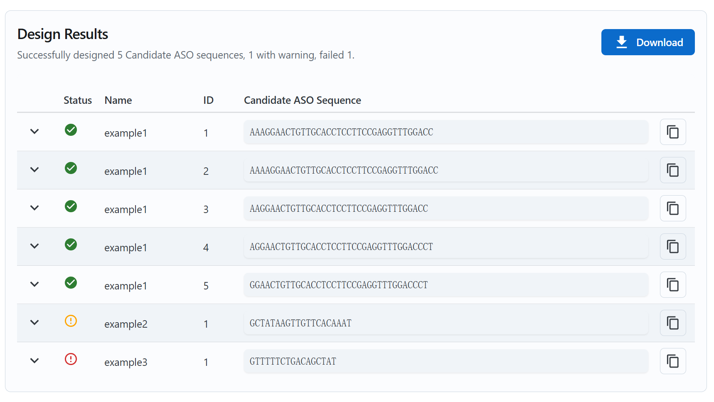
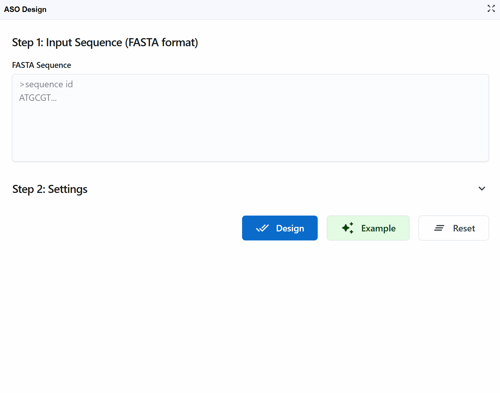

# ASO Design
{ class="cover-image-lg" }

## Overview

The ASO (Antisense Oligonucleotide) Design plugin is a sophisticated tool for designing therapeutic oligonucleotides and PCR primers with optimized binding properties and specificity. Built on the powerful Primer3 algorithm, this plugin automates the design process while considering critical parameters such as melting temperature, GC content, secondary structure formation, and off-target binding potential. Whether you're designing antisense therapeutics for gene knockdown, primers for RT-PCR validation, or probes for RNA detection, this plugin streamlines the workflow by integrating sequence data directly from RBrowser's visualization components. The tool provides ranked candidate sequences with quality assessments, detailed design logs, and exportable results for downstream experimental validation.

## Getting Started with ASO Design

### Basic Workflow

When you click the ASO Design plugin button, a new window opens providing a comprehensive interface for sequence input and parameter configuration.

**Input requirements:**

- **Format**: FASTA format (standard nucleotide sequence format)
- **Length**: Typically 50-5000 nucleotides (depends on your target region)

**Default parameters**: The plugin comes with optimized default parameters suitable for most common applications, so you can start designing immediately without detailed parameter adjustment.

### Example Design Workflow

{ class="cover-image-lg" }

This demonstration shows the complete design process from input to results:

1. **Load example data**: Click the **`Example`** button to load demonstration sequence data
2. **Start design**: Click the **`Design`** button to initiate the ASO/primer design algorithm
3. **Review results**: The tool returns the top 5 candidate sequences ranked by quality scores

**Result interpretation:**

Each candidate sequence is marked with a status indicator:

!!! success "Successful"
    - Meets all design criteria  
    - Optimal Tm, GC content, and minimal secondary structure  
    - Low off-target binding potential  
    - **Recommendation**: Excellent choice for experiments

!!! warning "Warning"
    - Meets most but not all optimal criteria  
    - May have slightly suboptimal Tm or GC content  
    - Acceptable as a backup option  
    - **Recommendation**: Use if successful candidates fail or for less critical applications

!!! danger "Error"
    - Fails one or more critical design criteria  
    - May form strong secondary structures  
    - High potential for off-target binding  
    - Very low or high Tm/GC content  
    - **Recommendation**: Avoid using these sequences

**Working with results:**

- **Copy sequences**: Click the :material-content-copy: button next to each candidate to copy the sequence to your clipboard for ordering or further analysis

- **View design logs**: Click the :material-chevron-down: (chevron down) button on the left of each candidate to expand detailed design logs
    - See parameter values for each candidate
    - Understand why sequences received their status (Successful/Warning/Error)
    - Review thermodynamic calculations and quality metrics
    - Examine secondary structure predictions
    - Check specificity assessments

- **Download results**: Click the **`Download`** button in the upper right to export all results as a table (CSV/Excel format) for:
    - Record keeping
    - Comparison with previous designs
    - Sharing with collaborators
    - Ordering oligonucleotides from vendors
    - Documentation for publications

- **Start new design**: Click the **`Redesign`** button in the lower right to return to the input page and begin a new design job with different sequences or parameters

## Design Parameters and Settings

The ASO Design tool provides extensive customization options based on Primer3 parameters, allowing you to fine-tune the design process for your specific experimental needs.

Beyond manual input, RBrowser provides two convenient automated input methods that integrate directly with the visualization components:

### ASO Design (Custom)
You can always paste your own custom sequences in FASTA format for maximum flexibility.

### ASO Design (Transcript)

The plugin seamlessly integrates with RBrowser's transcript navigation, automatically loading the complete transcript sequence when you switch between different transcripts.

{ class="cover-image-lg" }

**How it works:**

1. Navigate to a transcript of interest in the main RBrowser viewer
2. Open the ASO Design plugin
3. The full transcript sequence is automatically loaded as input
4. The FASTA header includes the transcript name and ID for easy tracking

**Use cases:**

- **Gene knockdown**: Design ASOs targeting the entire coding sequence or specific exons
- **Primer design**: Create primers spanning exon junctions for detecting specific isoforms
- **Validation**: Design RT-PCR primers for expression validation
- **Comprehensive coverage**: Screen multiple regions across the transcript for optimal target sites

**Advantages:**

- No manual copying or pasting required
- Ensures sequence accuracy (directly from genome annotation)
- Maintains transcript identity in results
- Facilitates systematic screening of multiple transcripts

**Workflow example:**

1. Use the transcript search to find your gene of interest (e.g., GAPDH, TP53)
2. The ASO Design plugin automatically loads the sequence
3. Adjust parameters if needed (or use defaults)
4. Click Design to generate ASO/primer candidates
5. Review results and select optimal candidates

### ASO Design (Selected Region)

For targeted design within specific genomic regions or transcript segments, the plugin can automatically load sequence from user-selected regions.

{ class="cover-image-lg" }

**How it works:**

1. Click and drag in the main RBrowser viewer to select a genomic region of interest
2. Open the ASO Design plugin while the region is selected
3. The sequence of the selected region is automatically loaded
4. The FASTA header contains the genomic coordinates (chromosome:start-end) for traceability

**Use cases:**

- **Target specific exons**: Select a single exon for exon-skipping ASOs
- **Avoid regulatory elements**: Select regions excluding important UTR elements
- **Structure-guided design**: Select single-stranded regions identified in RNA 2D structure
- **Modification-targeted ASOs**: Select regions containing specific RNA modifications
- **Regional optimization**: Focus design on specific transcript domains (5'UTR, CDS, 3'UTR)
- **Accessible regions**: Select regions with low secondary structure for optimal ASO binding

**Integration with other plugins:**

This feature is particularly powerful when combined with other RBrowser plugins:

- **RNA 2D Structure**: Select loop regions (more accessible) while avoiding stable stems
- **RNA 3D Structure**: Choose surface-exposed regions
- **RNA Modification Atlas**: Target or avoid modified nucleotides
- **RNA Sequence Viewer**: Select regions based on GC content or complementarity patterns

**Workflow example:**

1. View your transcript in the RNA 2D Structure plugin
2. Identify single-stranded loop regions (more accessible to ASOs)
3. Select the corresponding region in the main linear viewer
4. Open ASO Design—the loop sequence is loaded automatically
5. Design ASOs targeting this accessible region
6. Repeat for other accessible regions to generate multiple candidates

**Advantages:**

- **Precision targeting**: Design oligonucleotides for exact regions of interest
- **Structure-informed design**: Combine with structural data for optimal accessibility
- **Flexible region size**: Select small regions (10-100 nt) or larger domains (100-1000 nt)
- **Genomic context**: Coordinates preserved for mapping back to genome
- **Iterative refinement**: Easily adjust region boundaries and redesign

!!! tips
    - **For ASO therapeutics**: Select 50-200 nt regions in accessible areas
    - **For PCR primers**: Select regions spanning exon junctions (100-500 nt)
    - **For short ASOs**: Select 30-50 nt regions containing the target site
    - **For screening**: Select multiple small regions and design for each separately

---

## Design Strategies for Different Applications

### 1. Antisense Oligonucleotides (ASOs) for Therapeutics

**Goal**: Design ASOs for gene knockdown via RNase H-mediated mRNA degradation

**Recommended parameters:**
- Pick Left Primer: `1`, Pick Right Primer: `0` (single-stranded ASO)
- Optimal Primer Size: `18-20` nt
- Product Size Range: `30-50` (target region span)
- Max End Stability: `8.0` (avoid strong 3' binding)
- GC Clamp: `1`

**Strategy:**
1. Use RNA 2D Structure plugin to identify accessible single-stranded regions
2. Select these regions in the main viewer
3. Design ASOs using ASO Design plugin
4. Prioritize "Successful" status candidates
5. Test top 3-5 candidates experimentally

### 2. PCR Primers for RT-PCR Validation

**Goal**: Design primer pairs for detecting transcript expression

**Recommended parameters:**
- Pick Left Primer: `1`, Pick Right Primer: `1` (primer pair)
- Optimal Primer Size: `20` nt
- Product Size Range: `100-300` (standard amplicon)
- Number of Primer Pairs Returned: `5`

**Strategy:**
1. Load full transcript sequence
2. Use default parameters
3. Select primers spanning exon junctions (avoids genomic DNA amplification)
4. Verify specificity using BLAST if needed

### 3. qPCR Primers for Quantitative Analysis

**Goal**: Design primers for quantitative PCR with high efficiency

**Recommended parameters:**
- Pick Left Primer: `1`, Pick Right Primer: `1`
- Optimal Primer Size: `20` nt
- Product Size Range: `50-150` (short amplicon for qPCR)
- GC Clamp: `1-2` (stable 3' end)
- Max End Stability: `9.0`

**Strategy:**
1. Target coding regions for maximum expression
2. Avoid regions with high secondary structure
3. Design 3-5 primer pairs for validation
4. Experimentally validate with standard curve

### 4. Primers for Cloning and Mutagenesis

**Goal**: Design primers for cloning or site-directed mutagenesis

**Recommended parameters:**
- Optimal Primer Size: `25-30` nt (longer for specificity)
- Product Size Range: Variable based on insert size
- Max Poly-X: `3` (stricter control)

**Strategy:**
1. Select target region plus flanking sequences
2. Consider restriction sites if needed
3. Design longer primers for higher fidelity
4. Add custom sequences (restriction sites, tags) to primer ends post-design

### 5. Allele-Specific or SNP Discrimination Primers

**Goal**: Design primers that discriminate between alleles

**Recommended parameters:**
- Pick Right Primer: `1` (place SNP at 3' end)
- GC Clamp: `0-1` (mismatch at 3' end reduces efficiency)
- Max End Stability: `8.0` (lower stringency at 3' end)

**Strategy:**
1. Position SNP within last 5 bases of 3' end
2. Design one primer pair per allele
3. Test under stringent PCR conditions

---

### Troubleshooting Design Issues

**Issue**: All candidates have "Warning" or "Error" status
**Solution**: 
- Sequence may be GC-rich/poor, repetitive, or have strong secondary structure
- Relax parameters: increase Max Poly-X, adjust product size range
- Select a different target region

**Issue**: No primers returned
**Solution**:
- Sequence too short—ensure at least 50 nt input
- Parameters too stringent—use defaults
- Sequence contains too many Ns or ambiguous bases

**Issue**: Primers have high end stability
**Solution**:
- Reduce Max End Stability to 8.0
- Check for GC-rich regions at 3' end
- Select alternative regions

**Issue**: Primers form dimers
**Solution**:
- Check design logs for self-complementarity warnings
- Increase Number of Primer Pairs Returned and select alternatives
- Manually check candidates for complementarity

---

For additional support, please visit the [Contact](../5_contact/index.md) page.