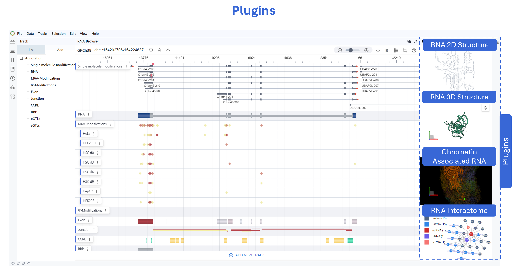

# Plugins

{ class="cover-image" }

## Content

#### [1. Plugin System](1_plugin_overview.md)
#### [2. RNA Modification](2_rna_modification_atlas.md)
#### [3. RNA Interction Network](3_rna_interaction.md)
#### [4. RNA Sequence Viewer](4_rna_sequence.md)
#### [5. RNA 2D Structure](5_rna_2d_structure.md)
#### [6. RNA 3D Structure](6_rna_3d_structure.md)
#### [7. RNA and Chromtin](7_rna_chromtin.md)
#### [8. Localization](8_localization.md)
#### [9. ASO Design](9_aso_design.md)
#### [10. Plugin Config](0_plugin_config.md)