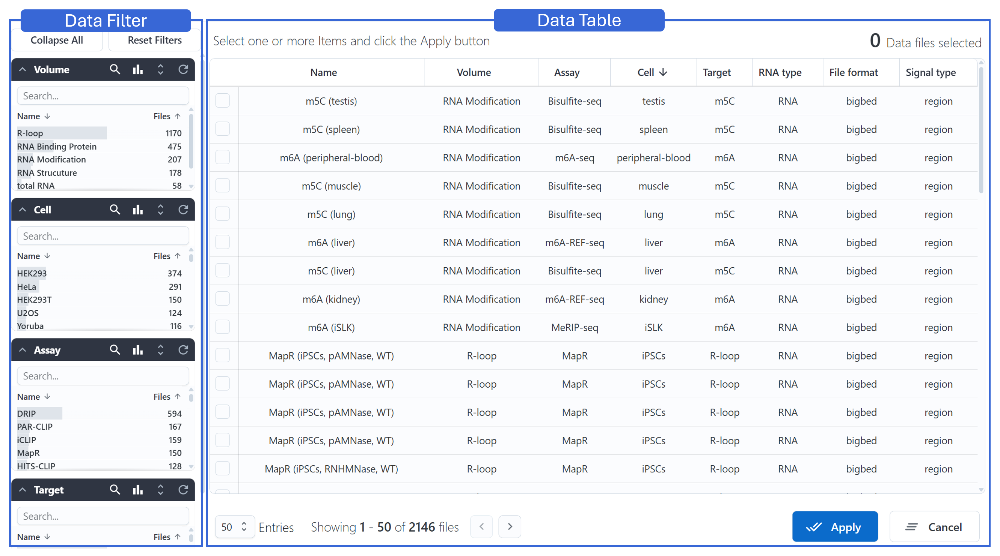
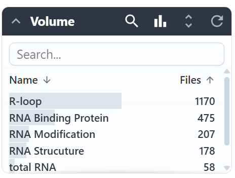
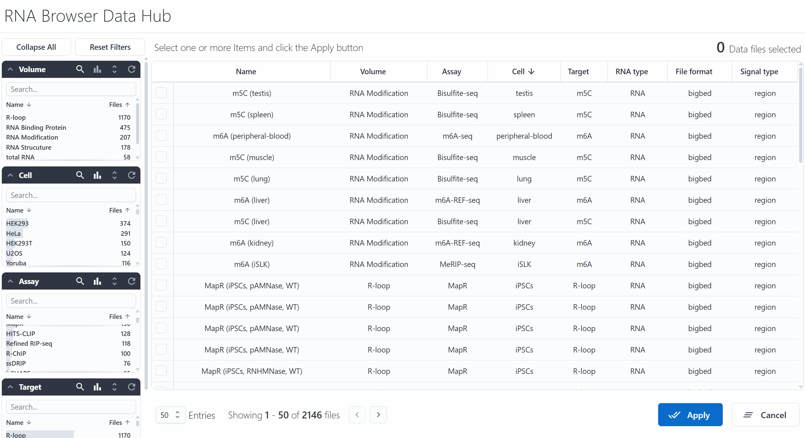
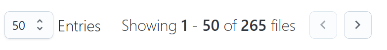
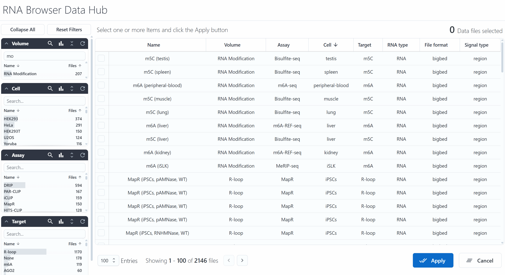

# DataHub
## Overview

An RNA-focused DataHub has been established to store datasets related to the transcriptome, RNA modifications, and RNA structures.

The DataHub interface is divided into two main panels:

- **Left: Data Filter** — allows users to narrow down and search for relevant datasets using categorized filters.
- **Right: Data Table** — displays the filtered dataset entries, which can be further explored by clicking to asynchronously load and render the selected data.

## Datasets Filter
The renderer organizes filters into multiple **sections**, each with its own toolbar.  
Using the `Volume` section as an example, the buttons from left to right represent:

- Collapse this section  
- Show/hide the search bar  
- Visualize item counts using bars for comparison  
- Show all items in this section  
- Reset the filter for this section  

{ class="cover-image-sm" }

When items are selected from a search, they are displayed at the bottom of the section.  
Clicking an item at the bottom will deselect it, and clicking **`Clear`** will remove all selections.

{ class="cover-image-sm" }

There are two global buttons:

- **`Collapse All` / `Expand All`**: collapses or expands all sections  
- **`Reset Filters`**: clears all section selections; the top-right corner displays the number of selected terms  

Below is an example of dynamic filter interactions:

{ class="cover-image-lg" }

## Data Table
The data table on the right displays the selected entries based on current filters.  
At the bottom-left of the table, there is a navigation bar with the following elements (from left to right):

- Number of entries displayed per page  
- Current entry index and total entries  
- Page navigation buttons  

{ class="cover-image-md" }

Below is an example showing how a user selects an item in the table and clicks **`Apply`** to send it to the main rendering panel:

{ class="cover-image-lg" }
