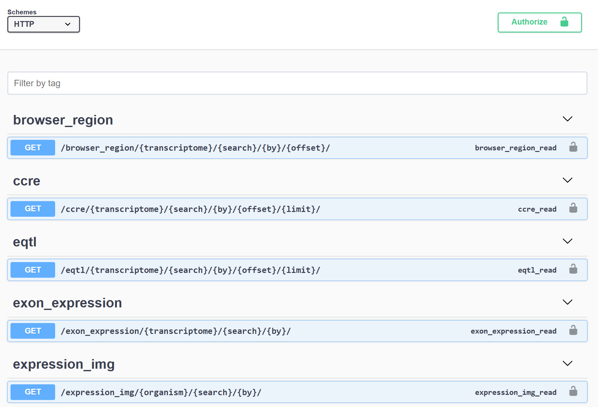
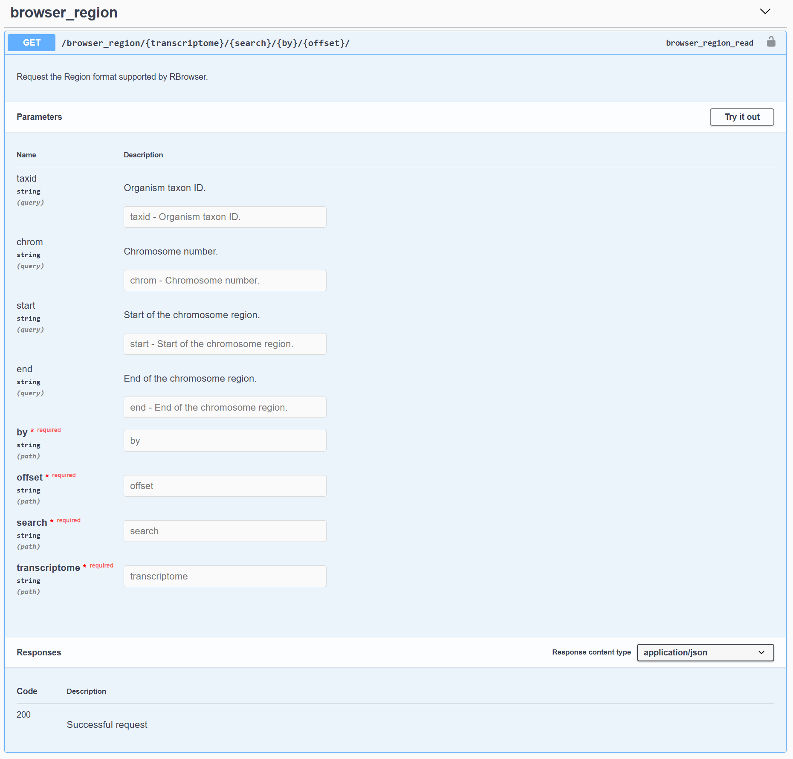
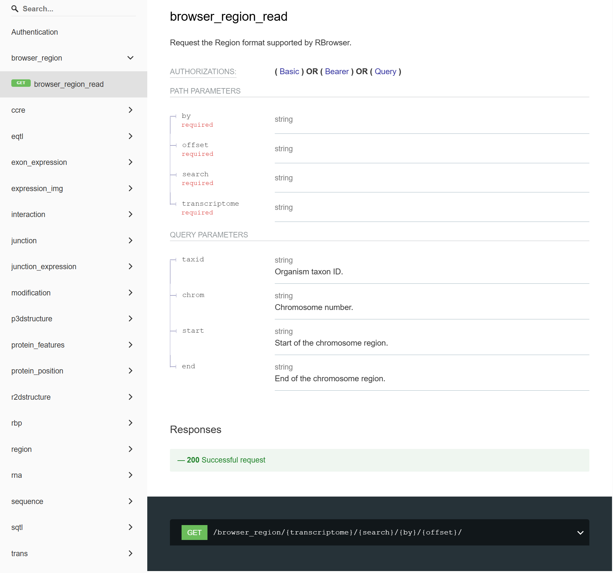

# RBrowser DataHub API


We provide a comprehensive set of Application Programming Interface (API) centered around RNA annotations and signal data.  
You can access the API at: [https://api.rbrowser.org/api/](https://api.rbrowser.org/api)

## Request Format

Each section offers a detailed request format along with the required data types.  
You can tailor requests based on their specific needs to retrieve relevant responses.  
You can click the `Try it out` button in the top right corner to test your requests and view the response structure.

{class="cover-image" }

## Example

### Request

Query the transcript `vamp3-201` with a 2000 bp flanking window:

[https://api.rbrowser.org/api/v1/browser_region/hg38/vamp3-201/tname/2000/](https://api.rbrowser.org/api/v1/browser_region/hg38/vamp3-201/tname/2000/)

You will get the genomic region, transcript region, and model region.

### Response

```json
HTTP 200 OK
Allow: GET, HEAD, OPTIONS
Content-Type: application/json
Vary: Accept

{
    "status": 1,
    "msg": "successful",
    "results": {
        "id": "A-IFfLp_gcc0SOkGCVL4y",
        "model_region": {
            "chr": "1",
            "start": 7769269,
            "end": 7783432
        },
        "trans_region": {
            "chr": "1",
            "start": 7769296,
            "end": 7783432
        },
        "region": [
            {
                "chrom": "1",
                "start": 7771296,
                "end": 7781432,
                "strand": "+",
                "gene_id": "ENSG00000049245",
                "trans_id": "ENST00000054666",
                "trans_name": "VAMP3-201",
                "trans_type": "protein_coding"
            }
        ]
    }
}
```

## Other API document
If you're not comfortable using this API documentation, we also provide an alternative version.

You can access the API at: [https://api.rbrowser.org/doc/](https://api.rbrowser.org/doc/)

{class="cover-image" }